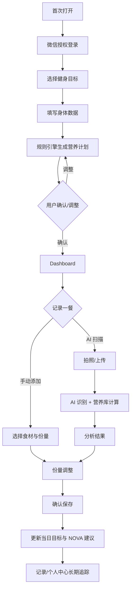
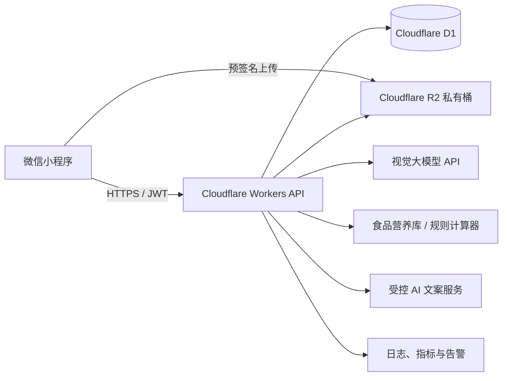

# Nordic Nutri AI 产品需求文档 PRD V1.0

| 项目 | 内容 |
| --- | --- |
| 产品形态 | 微信小程序 |
| 文档版本 | V1.0 |
| 目标版本 | MVP（Phase 1） |
| 核心定位 | 基于 AI 视觉识别与可复算营养规则的个人健身营养助手 |
| 非目标 | 医疗诊断、疾病治疗建议、替代专业医师或营养师 |

## 1. 产品介绍

### 1.1 产品愿景与价值

Nordic Nutri AI 帮助健身和健康管理用户，以最少操作完成「看见一餐、理解一餐、记录一餐、调整下一餐」的每日营养闭环。产品将图片理解交给 AI，将热量与三大营养素的计算交给确定性规则，从而兼顾便利性、可解释性与可追溯性。

核心价值：

- **快**：拍照或手动补录即可生成一餐营养估算。
- **准且可改**：AI 给出候选食材与份量，用户可修正；确认后实时重算。
- **有行动性**：首页显示今日剩余目标，并给出下一餐可执行的补充建议。
- **可长期坚持**：日历记录、连续打卡、完成率与成就提供正反馈。

### 1.2 设计原则

- 北欧克制健康感：暖白背景、深森林绿主色、圆角卡片、自然食物图片；不以夸张图表制造焦虑。
- 一餐只需一次关键确认：识别结果可编辑，保存前明确展示热量与三大营养素。
- 计算结果与 AI 文案分层：数值来源可追溯，建议不得伪装成医疗结论。
- 目标优先：任何建议均围绕用户目标、当日剩余宏量营养素、训练安排产生。

### 1.3 一期范围与边界

一期交付登录、建档、营养计划、AI 食物扫描、手动记录、份量调整、饮食记录、首页反馈、基础个人中心及“固定建议 + 快捷问答”的 AI 营养师。

一期不包含：连续体重曲线、周报分享、开放式多轮营养诊断、会员付费、食谱商城、可穿戴设备同步、医疗/过敏诊断。

## 2. 用户分析

| 用户画像 | 特点与场景 | 核心痛点 | 产品解决方式 |
| --- | --- | --- | --- |
| 健身增肌用户 | 18–35 岁；每周训练 3–6 次；训练后或备餐时记录 | 不知热量盈余是否足够；蛋白质难持续达标；餐后不知如何补 | 以增肌默认宏量比例生成计划；首页显示蛋白缺口；扫描后提示是否适合训练后补给 |
| 减脂用户 | 有体重/体脂下降目标；外食频繁；晚餐与聚餐前后使用 | 热量容易超标；低估油脂和份量；节食后无法平衡营养 | 以温和热量缺口生成计划；按日显示剩余预算；对高能量密度餐给出替换与份量建议 |
| 普通健康管理用户 | 关注饮食均衡、精神状态与体重稳定；使用频率较低 | 营养概念抽象；不愿复杂称重；难形成长期记录习惯 | 简化为拍照、确认、保存；以餐点评价和连续记录建立轻量习惯 |

## 3. 功能需求

### 3.1 页面 1：首次引导与目标选择

**目标**：在首次登录后的 2 分钟内完成目标建档，降低空白首页的困惑。

页面展示产品名称、进度（1/3）和四张目标卡：增肌、减脂、保持体型、提升运动表现。每张卡说明适用人群及非医疗提示；单选后“下一步”可用。

流程：首次打开 → 微信授权登录 → 选择目标 → 身体信息。返回时保留未提交草稿；完成建档后从个人中心修改，不重新触发引导。

保存规则：点击下一步仅保存本地 onboarding 草稿；在“生成计划”确认时，`user_goal` 与 `body_profile` 原子提交。若网络中断，提示“资料已保存在本机，联网后继续”。

异常：拒绝登录时可浏览说明但不能生成或保存个人计划；重复提交用幂等键防止生成多个当前计划；已建档用户进入首页。

### 3.2 页面 2：身体信息填写

| 字段 | 类型/默认值 | 校验 | 修改规则 |
| --- | --- | --- | --- |
| 年龄 | 整数；无默认 | 14–80 岁 | 可随时改；变更后提示重算计划 |
| 性别 | 女/男/不透露；必选 | 选择其一 | “不透露”采用中性估算，并提示精度可能降低 |
| 身高 | cm；无默认 | 120–230，整数 | 可改，影响 BMR |
| 当前体重 | kg；无默认 | 30–300，最多 1 位小数 | 可改，影响 BMR 与目标 |
| 日常活动量 | 久坐/轻度/中度/高/极高；默认中度 | 必选 | 显示解释示例 |
| 每周训练频率 | 0–7 天；默认 3 | 整数 | 与活动量共同决定 TDEE，不单独叠加两次 |
| 目标体重、目标日期 | 可选 | 30–300 kg；日期晚于今天 | 保存于目标表；仅用于进度展示和建议强度，不做医疗承诺 |

### 3.3 页面 3：AI 生成个人营养计划

**计算逻辑（推荐方案 1）**：

1. BMR：按 Mifflin–St Jeor 公式计算；性别不透露时使用中性系数并标记为估算。
2. TDEE：`BMR × 活动系数`。久坐 1.2、轻度 1.375、中度 1.55、高 1.725、极高 1.9；训练频率用于校正活动档位提示，不重复加算。
3. 热量目标：增肌 `TDEE + 250~350`；减脂 `TDEE - 300~500`（最低不低于 BMR 的 1.2 倍，且给出安全提示）；保持为 TDEE；运动表现为 TDEE + 5%~10%。
4. 蛋白质：增肌 1.8–2.2 g/kg，减脂 1.8–2.2 g/kg，保持 1.4–1.8 g/kg，运动表现 1.6–2.0 g/kg。
5. 脂肪：默认 0.8–1.0 g/kg，且不低于总热量 20%；剩余热量换算为碳水。换算关系为蛋白/碳水 4 kcal/g、脂肪 9 kcal/g。
6. 所有数值按：热量取整至 10 kcal、宏量取整至 1 g；总热量与宏量换算差异允许 ±3%。

页面展示每日热量、蛋白、碳水、脂肪、计算依据与“调整计划”。用户可编辑热量或任一宏量，系统按剩余宏量自动平衡；若编辑后违反最低脂肪或热量阈值，阻止保存并给出原因。确认时创建新版本计划，将旧版本置为失效；历史餐次保留当时计划快照。

### 3.4 页面 4：首页 Dashboard

首页是每日健康中心，默认“今天”，支持下拉刷新。

- 顶部：头像、问候语、当前目标。
- 目标卡：已摄入/每日目标热量、剩余热量环形进度；蛋白/碳水/脂肪已摄入与进度条。超标以文字“已超出 X”替代负数环。
- NOVA 建议：每日首次进入或数据变更后生成；明确缺口、优先营养素和 1–2 个食品示例。示例不使用疾病、绝对化或羞耻性表达。
- 快捷入口：AI 拍照识别、手动添加饮食。
- 今日饮食：早餐/午餐/晚餐/加餐，按记录时间自动归类；每个卡片展示封面、名称、kcal、蛋白与编辑入口；空餐次显示“记录晚餐”等引导。

汇总公式为当天已确认、未删除的 `meal_record` 营养素之和；编辑/删除后需立即重算并刷新建议。

### 3.5 页面 5：AI 食物扫描

流程：打开扫描页 → 请求相机权限 → 拍摄或从相册选图 → 本地压缩与上传 → 创建 AI 分析任务 → 轮询/推送结果 → 营养分析结果页。

AI 返回食物主名称、食材清单、估计份量（g）、热量、蛋白、碳水、脂肪、置信度、识别局限与建议。服务端应要求模型返回符合 JSON Schema 的结构；营养数值以“食材 + 份量 + 食物营养数据库”计算，模型不得直接作为唯一数值来源。

异常处理：

- 图片模糊/过暗：提示重拍要点，可转手动记录。
- 无法识别：不保存分析；可重新拍摄或手动添加。
- 多种食物：拆分为多个食材项，展示“请确认每项份量”；无法拆分时标记低置信度。
- 网络失败/超时：保留本地图片和草稿，可重试；上传超时 30 秒、分析超时 45 秒。
- 权限拒绝：显示授权路径与“从相册选择”备选。

### 3.6 页面 6：营养分析结果

展示原图、菜品名称、扫描时间、总热量、三大营养素、食材列表、置信度提示、餐点评级（A–D）与 AI 评价。评级仅表示与用户当日目标的匹配程度，不评价食物“好/坏”：A 为高匹配，B 为可搭配，C 为需调整份量/结构，D 为明显超出当前剩余预算或识别不确定。

操作：调整份量、重新扫描、保存为一餐。未点击保存时仅为 `ai_analysis` 草稿，24 小时后清理；保存时创建 `meal_record` 和多条明细，并将分析关联到记录。保存成功后返回首页并刷新当天汇总。

### 3.7 页面 7：AI 份量调整

每个食材展示名称、单位、份量输入/步进器（默认步长 10 g；液体 10 ml；计数单位可选个/份），并实时展示总热量与三大营养素。用户可新增、删除食材或改名；手动新增项默认从营养数据库查询候选。

重算公式：每项营养 = 每 100g 标准营养 × 份量/100；餐次总量 = 所有项之和。用户编辑不覆盖原始 AI 输出，分别保留 `ai_quantity_g` 和 `confirmed_quantity_g` 以支持质量回溯。禁止负数；0 视为删除；单项超过 2,000 g 时二次确认。

### 3.8 页面 8：单餐详情

展示图片、餐次、记录时间、总营养、食材明细和 AI 洞察。支持编辑、删除、收藏。

编辑进入份量调整并保留原图；删除需二次确认，采用软删除，立即更新当天总计；收藏保存为可复用的“常吃餐”，不自动复用图片。只能操作本人记录。

### 3.9 页面 9：饮食记录

按月日历与按日列表展示历史。选择日期后显示当日餐次、日总热量与宏量完成情况；搜索支持菜品/食材名称、日期范围、餐次。默认最近 30 天，单次最多返回 100 条；无数据时提供扫描和手动添加入口。

### 3.10 页面 10：AI 营养师（一期受控版）

入口展示当天一句建议和四类快捷问题：“今天蛋白够吗？”“晚餐怎么安排？”“增肌怎么吃？”“减脂如何控制？”。一期不提供开放文本输入；点击后以模板提问调用服务端，返回不超过 3 条可执行建议及免责声明。

上下文来源：当前有效营养计划、当天已确认餐次汇总、今日剩余目标、最近 7 天达标趋势、用户目标/活动量；不读取已删除记录，不向模型发送 OpenID、头像等身份数据。若无计划或无记录，返回建档/记录引导而非编造结论。

### 3.11 页面 11：个人中心

展示头像昵称、当前体重、目标与健身方向；数据卡包括总记录次数、连续打卡天数、近 30 日蛋白完成率；成就包括“30 天记录”“蛋白达人”。

连续打卡定义为相邻自然日均至少有一条已确认饮食记录；蛋白完成率定义为统计期内蛋白摄入达到计划 90%–110% 的天数/有记录天数。支持编辑资料、调整目标、重新生成计划与隐私/数据删除入口。

## 4. 完整用户流程

关键状态：未建档、建档草稿、计划生效、分析草稿、已保存餐次、已删除餐次。所有保存动作需成功提示；所有会改变汇总的数据操作必须可见地刷新首页与记录页。

## 5. 数据库设计（Cloudflare D1）

通用字段：所有表使用 UUID `id`、ISO 8601 UTC 时间 `created_at`/`updated_at`；用户可见时间按其时区（默认 Asia/Shanghai）换算。金额/营养值使用 `REAL`，热量单位 kcal，其余宏量单位 g。

| 表 | 关键字段 | 说明与索引 |
| --- | --- | --- |
| `user` | `id`、`openid`(唯一)、`nickname`、`avatar_url`、`timezone`、`onboarding_completed_at` | `UNIQUE(openid)`；不保存微信原始敏感授权数据 |
| `user_goal` | `id`、`user_id`、`goal_type`、`target_weight_kg`、`target_date`、`is_current` | 枚举：muscle_gain/fat_loss/maintain/performance；索引 `(user_id,is_current)` |
| `body_profile` | `id`、`user_id`、`age`、`sex`、`height_cm`、`weight_kg`、`activity_level`、`training_days_per_week`、`effective_at` | 保留历史快照；索引 `(user_id,effective_at DESC)` |
| `nutrition_plan` | `id`、`user_id`、`goal_id`、`body_profile_id`、`daily_calories_kcal`、`protein_g`、`carbs_g`、`fat_g`、`formula_version`、`status`、`effective_from`、`effective_to` | status: active/superseded；每用户最多一个 active |
| `meal_record` | `id`、`user_id`、`analysis_id`、`meal_type`、`name`、`image_key`、`recorded_at`、`total_calories_kcal`、`protein_g`、`carbs_g`、`fat_g`、`is_favorite`、`deleted_at` | 索引 `(user_id,recorded_at DESC)`、`(user_id,deleted_at)` |
| `meal_item` | `id`、`meal_record_id`、`food_id`、`name`、`ai_quantity_g`、`confirmed_quantity_g`、`calories_per_100g`、`protein_per_100g`、`carbs_per_100g`、`fat_per_100g` | 记录保存时的营养快照，避免食品库变更影响历史 |
| `ai_analysis` | `id`、`user_id`、`image_key`、`status`、`model_name`、`raw_result_json`、`confidence`、`advice`、`error_code`、`expires_at` | status: pending/succeeded/failed/saved；索引 `(user_id,created_at DESC)` |
| `food_catalog` | `id`、`canonical_name`、`aliases_json`、`serving_unit`、每100g营养字段、`source` | 初期由受控食品库维护；按名称/别名检索 |
| `coach_interaction` | `id`、`user_id`、`question_type`、`context_snapshot_json`、`answer_json` | 仅保存受控问答与脱敏快照，便于质量追踪 |

关系：`user` 1:N 目标、身体档案、计划、分析、餐次；`meal_record` 1:N `meal_item`；一条餐次可选关联一条分析。图片仅保存 R2 object key，不将私有对象 URL 写入数据库。

## 6. REST API 设计

统一约定：前缀 `/api/v1`；`Authorization: Bearer <session_token>`；返回 `{ "code": 0, "message": "ok", "data": {} }`；参数错误 400、未登录 401、无权限 403、资源不存在 404、幂等冲突 409、服务错误 500、AI 不可用 503。写操作携带 `Idempotency-Key`。

| 接口 | 方法/路径 | 请求参数 | 成功返回 `data` |
| --- | --- | --- | --- |
| 微信登录 | `POST /auth/wechat` | `code` | `token`、`expires_at`、`user`、`onboarding_completed` |
| 获取用户 | `GET /users/me` | — | 用户资料、当前目标、当前身体档案 |
| 更新用户 | `PATCH /users/me` | `nickname?`、`avatar_url?`、`timezone?` | 更新后用户 |
| 创建/更新目标 | `PUT /users/me/goal` | `goal_type`、`target_weight_kg?`、`target_date?` | 当前目标 |
| 写身体档案 | `POST /users/me/body-profiles` | 年龄、性别、身高、体重、活动量、训练频率 | `body_profile`、`requires_plan_refresh` |
| 生成计划 | `POST /nutrition-plans/generate` | `goal_id?`、`body_profile_id?`、`overrides?` | `plan`、`calculation_explanation` |
| 获取当前计划 | `GET /nutrition-plans/current` | — | `plan`、生效时间 |
| 调整计划 | `PATCH /nutrition-plans/:id` | 热量/蛋白/碳水/脂肪任一项 | 校验后的新 `plan` |
| 创建上传凭证 | `POST /uploads/images` | `mime_type`、`size_bytes`、`sha256` | R2 预签名上传 URL、`object_key`、过期时间 |
| 发起 AI 分析 | `POST /ai/analyses` | `image_key`、`locale?` | `analysis_id`、`status=pending` |
| 获取分析结果 | `GET /ai/analyses/:id` | — | 状态、食材、份量、营养、置信度、建议 |
| 保存餐次 | `POST /meal-records` | `analysis_id?`、`name`、`meal_type`、`recorded_at`、`items[]`、`image_key?` | `meal_record`、更新后的日汇总 |
| 查询餐次 | `GET /meal-records` | `date?`、`start_date?`、`end_date?`、`q?`、`meal_type?`、`cursor?` | `items`、`next_cursor`、每日汇总 |
| 获取/修改餐次 | `GET/PATCH /meal-records/:id` | PATCH: 名称、时间、餐次、`items[]`、收藏状态 | 完整餐次及重算营养 |
| 删除餐次 | `DELETE /meal-records/:id` | — | `deleted_id`、更新后的日汇总 |
| 获取首页 | `GET /dashboard?date=YYYY-MM-DD` | `date?` | 计划、已摄入、剩余、今日餐次、NOVA 建议 |
| AI 营养师快捷问答 | `POST /coach/answers` | `question_type` | `answer`、`context_date`、免责声明 |

服务端不得信任客户端提交的餐次总营养；必须根据 `items[]` 的食物营养快照重新计算。分页接口使用游标，不使用无限 offset。

## 7. 技术架构建议

- **前端**：原生微信小程序（TypeScript），分包：onboarding、home、scan、records、coach、profile；本地缓存草稿和当天 Dashboard，敏感数据不长期明文缓存。
- **后端**：Cloudflare Workers 提供 REST API、鉴权、输入校验、任务编排、限流与幂等；AI 调用使用超时、重试和熔断。
- **数据**：D1 存业务关系与营养快照；R2 私有存图片，Worker 生成短时访问签名；图片上传后做 MIME、大小、像素与恶意内容校验。
- **AI**：视觉模型只产出候选食材、份量、置信度和解释；规则计算器结合受控食品库输出营养数值。无法匹配时标记待确认，不伪造精度。
- **安全与合规**：最小化收集；OpenID 加密/受控访问；所有资源按 `user_id` 鉴权；提供账户数据导出/删除路径；提示估算误差与非医疗属性；监控 AI 输出异常、识别失败率和单位成本。

## 8. 开发拆分计划

### Phase 1：MVP 基础版本（建议 6–8 周）

1. 基础设施：小程序骨架、Worker、D1 migration、R2 私有上传、微信登录、监控与错误码。
2. 建档与计划：目标、身体档案、确定性计算器、计划确认/调整、Dashboard 汇总。
3. 记录闭环：手动添加、食品库查询、餐次 CRUD、日历/搜索、份量实时重算。
4. AI 扫描：上传、异步识别、结构化结果、置信度与失败兜底、确认保存。
5. 受控 AI 营养师：四类快捷问题、上下文快照、固定建议。
6. 质量门槛：主要流程成功率、异常兜底、数据隔离、营养重算测试、真机相机/网络弱网验收。

**MVP 验收指标**：首次建档完成率 ≥ 70%；分析成功率 ≥ 85%（可识别图片）；分析结果确认保存率 ≥ 60%；餐次编辑/删除后 Dashboard 在 2 秒内一致；所有跨用户资源访问均被拒绝。

### Phase 2：增强版本

- 身体变化记录与趋势洞察；周营养报告与可分享卡片。
- 可编辑食材库、常吃餐模板、批量复用与更细的餐次目标。
- AI 营养师升级为受限多轮对话，但仍基于已授权上下文并设置安全边界。
- 提醒策略：记录提醒、蛋白缺口提醒；支持用户关闭。

### Phase 3：商业化版本

- 会员体系：按月/年订阅、权益校验、订单与退款状态同步。
- 高级 AI：更高识别额度、个性化周期计划、训练日/休息日宏量切换、深度报告。
- 商业化原则：免费层保留基础记录与数据导出；付费功能清晰标识，不以健康焦虑驱动转化。

## 9. 风险与验收原则

| 风险 | 控制策略 |
| --- | --- |
| 食物识别和份量误差 | 强制确认页、可编辑食材/份量、置信度标识、手动录入兜底 |
| 营养建议被误解为医疗建议 | 首屏与 Coach 明示非医疗；高风险提问转向寻求专业人士 |
| AI 成本或响应不稳定 | 图片压缩、缓存相同 hash、任务超时、降级到手动记录 |
| 计划不适配个人 | 规则版本可追踪、用户可改、资料变更后提示重算 |
| 隐私泄露 | 私有存储、最小权限、用户级鉴权、短期签名 URL、可删除数据 |

## 10. 待产品运营确认项

1. 视觉模型与食品营养数据源的地区覆盖优先级（中国常见餐食、北欧食物或全球）。
2. 微信登录后的昵称头像获取方式及隐私授权文案。
3. 成就的具体门槛、是否允许公开分享，以及会员价格与权益（均不阻塞 MVP 主闭环）。
