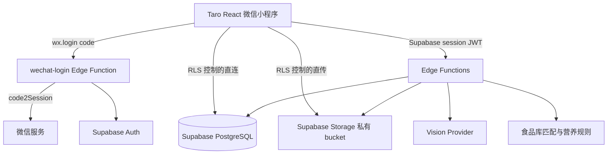
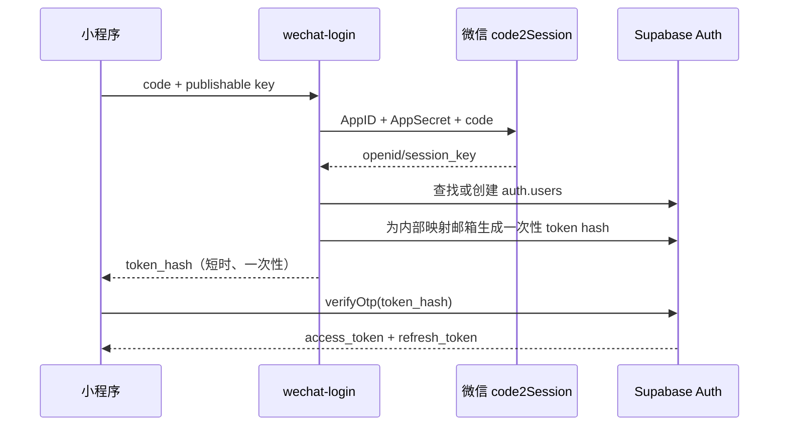

# Nordic Nutri AI 技术设计文档 V2.0

| 项目 | 决策 |
| --- | --- |
| 客户端 | Taro + React + TypeScript；默认微信小程序构建，保留 H5 构建能力 |
| BaaS | Supabase Auth、PostgreSQL、Storage、Edge Functions |
| AI | 可替换的 DeepSeek Vision / OpenAI Vision Provider |
| 计算原则 | AI 只识别；营养库与规则引擎负责数值计算 |
| 数据隔离 | `auth.users.id` 为唯一用户边界；PostgreSQL 与 Storage 双重 RLS |
| MVP Coach | 受控快捷问答，不开放自由多轮诊断 |

## 1. 最终技术架构



### 1.1 职责边界

- 小程序：采集输入、压缩图片、展示状态与本地草稿；不得保存特权密钥、微信 AppSecret 或 AI Key。
- Supabase Auth：签发/刷新用户 JWT，给 RLS 和 Edge Function 提供统一身份；不把微信 OpenID 作为访问凭证。
- PostgreSQL：存放用户域数据、食品营养快照、分析状态与审计数据；数值以数据库/函数返回为准。
- Storage：仅保存私有食物图片；表内只保存 `object_path`，不保存可长期访问的 URL。
- Edge Functions：处理微信凭证交换、业务写入、AI 调用、规则计算与限流。所有调用第三方 AI 的请求均从此层发出。

### 1.2 请求与数据流

1. 首次登录：`wx.login()` 获得短期 code；调用无会话的 `wechat-login`。
2. 函数用服务端的微信 AppSecret 调用微信 `code2Session`，得到 OpenID；按 OpenID 哈希查找或创建对应 `auth.users` 与 `profiles`。
3. 函数生成短期、一次性的 Supabase OTP token hash。小程序立刻调用 Supabase Auth `verifyOtp` 换取 `access_token` 与 `refresh_token`，并用 `wx.setStorage` 的加密/受控适配器保存会话。
4. 后续读取低风险、RLS 可直接表达的数据（本人资料、餐次、计划）可经 Supabase Data API；聚合、外部调用和跨表事务都经 Edge Function。
5. 所有写操作携带 `Idempotency-Key`；Functions 在 `request_id`/业务唯一键下去重，成功后返回统一数据模型。

### 1.3 图片处理与 AI 分析流

1. 小程序拍照/选图，在端侧修正方向、限制最长边 2048px、JPEG/WebP 质量约 0.8，目标 ≤2MB。
2. 客户端先校验 MIME、尺寸和文件大小，生成 UUID 文件名，按 RLS 直传 `food-images/{user_id}/{YYYY}/{MM}/{uuid}.jpg`。
3. 上传成功后调用 `analyze-food`，传入 `object_path` 与 SHA-256。函数先验证路径第一段等于 JWT 用户 ID，再创建 `ai_analysis(pending)`。
4. 函数从私有 Storage 下载图片，进行服务端 MIME/魔数、像素、大小复核；向视觉模型发送临时二进制/短时签名 URL。
5. 模型仅返回结构化候选食材、估计份量、置信度和识别备注。函数对 JSON Schema 校验，按别名匹配 `food_catalog`，以每 100g 营养快照乘以确认前估计份量计算总值。
6. 结果写回 `ai_analysis(succeeded)`；小程序轮询分析状态或按 1.5 秒、最多 30 秒读取。用户修正份量后调用 `calculate-nutrition`；确认保存才写入 `meal_records` 与 `meal_items`。

失败时保留分析草稿和图片 24 小时；超时、低置信度或无法匹配时提供重新扫描和手动记录，绝不捏造营养数字。

## 2. 项目整体目录设计

```text
Nordic-Nutri-AI/
├─ src/                         # Taro React 小程序源码
│  ├─ pages/                    # 路由页面；按页面独立 .ts/.wxml/.wxss/.json
│  │  ├─ onboarding/ body-profile/ nutrition-plan/ home/
│  │  ├─ food-scanner/ analysis-result/ portion-adjustment/
│  │  ├─ meal-detail/ meal-records/ coach/ profile/
│  ├─ components/               # 可复用纯展示/交互组件：macro-card、meal-card、loading、empty-state
│  ├─ services/                 # 业务编排：auth、upload、analysis、nutrition、meal、coach
│  ├─ stores/                   # session、profile、daily-nutrition、analysis-task 等全局可观察状态
│  ├─ utils/                    # 日期时区、数值格式化、图片压缩、校验、错误映射、幂等键
│  ├─ api/                      # Supabase client 适配器、Edge Function 调用封装、请求/响应 DTO
│  ├─ types/                    # 数据库实体、DTO、页面状态、枚举与 API 合约
│  ├─ assets/                   # 静态图标、插画、字体许可资源
│  ├─ app.ts / app.json / app.wxss
│  └─ config/                   # 非敏感环境配置；project URL 和 publishable key 仅由构建注入
├─ supabase/
│  ├─ migrations/               # 可顺序执行、可审阅的 PostgreSQL DDL、RLS、函数、索引
│  ├─ functions/                # 每个 Edge Function 一个目录，含 index.ts、共享校验/Provider 模块
│  │  └─ _shared/               # auth、CORS、错误、schema、AI provider、nutrition rule 等共享代码
│  ├─ seed/                     # food_catalog 初始数据及测试用户以外的可公开种子
│  ├─ tests/                    # SQL/RLS 与 Function 合约测试（后续实现阶段创建）
│  └─ config.toml               # 本地 Supabase 配置；不得含真实密钥
├─ docs/                        # PRD、技术设计、接口与运维文档
└─ scripts/                     # 仅放可重复的开发/校验脚本，不含密钥
```

页面目录只处理页面生命周期与 UI 组合；所有可测试业务逻辑下沉到 `services/`，所有网络细节限制在 `api/`。这避免页面直接拼 SQL、Storage 路径或 AI 参数。

## 3. 页面技术设计

| 页面 | 职责与 UI | 数据/接口 | 状态与流程 | 异常处理 |
| --- | --- | --- | --- | --- |
| Onboarding | 目标卡、步骤条、继续按钮 | `profiles`、`user_goals`；`PUT /goal` | 本地 `onboardingDraft`，选目标→下一页；仅最终确认落库 | 登录失效重登；离线保留草稿 |
| Body Profile | 数字输入、性别/活动量选择、校验提示 | `body_profiles`；`POST /body-profile` | `profileDraft`；填写→提交→生成计划 | 范围/单位校验；网络失败可重试 |
| AI Nutrition Plan | 热量和 P/C/F 卡、计算依据、编辑控件 | `generate-plan`、`nutrition_plans` | `planPreview`；生成→调整→确认版本 | 低热量/最低脂肪违反规则时禁存 |
| Home Dashboard | 目标环、宏量条、NOVA 卡、今日餐次、快捷入口 | `meal-summary` | `dailyNutritionStore`；进入/下拉刷新；保存餐次后失效重取 | 无计划引导建档；聚合失败显示上次缓存与重试 |
| AI Food Scanner | 相机预览、相册、扫描中状态 | Storage upload、`analyze-food` | `analysisTaskStore`；拍照→压缩→上传→创建任务→轮询 | 权限拒绝转相册；模糊/超时转手动添加 |
| Nutrition Analysis Result | 原图、食材、总营养、置信度、评级、操作按钮 | `GET /ai-analysis/:id` | 只读 `analysisResult`；调整/保存/重扫 | pending 显示进度；failed 展示可理解错误和重试 |
| Portion Adjustment | 食材行、份量步进器、实时营养汇总 | `calculate-nutrition`、`create-meal` | 页面本地草稿即时预估，防抖调用服务端权威重算 | 0 删除、负数拒绝、过大份量二次确认 |
| Meal Detail | 图片、时间、营养、食材、收藏/编辑/删除 | `GET/PATCH/DELETE /meal-records/:id` | 单条详情缓存；变更后失效 Home/Records 缓存 | 非本人 404；删除二次确认；乐观更新失败回滚 |
| Meal Records | 日历、日期摘要、搜索、餐次列表 | `GET /meal-records` | `recordsStore` 按日期和 cursor 缓存 | 空态引导；分页重复请求去重 |
| AI Coach | 当日洞察、4 个快捷问题、答案卡 | `coach-answer` | `coachStore` 缓存当天每类问题答案 | 无计划/无记录返回引导；模型失败返回规则建议 |
| Profile | 用户资料、目标、体重、统计与成就 | `GET/PATCH /profiles`、`meal-summary?range=30d` | `sessionStore` + `profileStore`；编辑后刷新计划提示 | 资料校验；会话失效清理本地状态并重新登录 |

直接使用 Supabase Data API 的页面查询必须遵循 RLS；涉及聚合、外部 AI、事务保存和 OpenID 的操作只可走 Edge Function。

## 4. Supabase PostgreSQL 数据库设计

### 4.1 建模约定

- 所有业务主键使用 `uuid`，默认 `gen_random_uuid()`；用户外键统一引用 `auth.users(id)`，避免第二套身份主键。
- 使用 `timestamptz`、`numeric(p,s)`，不使用浮点数累计热量；所有业务表有 `created_at`、`updated_at`。
- 表在 `public` schema，全部启用 RLS；敏感 OpenID 不作为可直读列，存入 `private.wechat_identities`（私有 schema）。
- 枚举通过 `CHECK` 约束实现，迁移更易演进；删除采用 `deleted_at` 的软删除时，所有查询必须过滤。
- 除被复合索引左前缀覆盖的列外，每个外键创建索引；`nutrition_plans(goal_id)`、`nutrition_plans(body_profile_id)`、`ai_analysis(user_id)`、`meal_records(analysis_id)`、`meal_records(plan_id)`、`meal_items(meal_record_id)`、`coach_messages(user_id)` 均不可遗漏。PostgreSQL 不会自动为外键创建索引。

### 4.2 表字段

#### `users`（应用用户投影；与 Auth 一对一）

| 字段 | 类型 | 空 | 默认值 | 说明 |
| --- | --- | --- | --- | --- |
| id | uuid PK FK `auth.users(id)` | 否 | — | Auth 用户 ID |
| status | text | 否 | `'active'` | active/deleted/suspended |
| created_at / updated_at | timestamptz | 否 | `now()` | 审计时间 |

`id` 主键；`status` CHECK；仅服务端创建，客户端只可读自己的行。

#### `profiles`

| 字段 | 类型 | 空 | 默认值 | 说明 |
| --- | --- | --- | --- | --- |
| id | uuid PK FK `users(id)` | 否 | — | 与用户同 ID |
| nickname | text | 是 | null | 1–40 字符显示名 |
| avatar_path | text | 是 | null | 私有 Storage 对象路径 |
| timezone | text | 否 | `'Asia/Shanghai'` | IANA 时区 |
| onboarding_completed_at | timestamptz | 是 | null | 建档完成时间 |
| created_at / updated_at | timestamptz | 否 | `now()` | 审计时间 |

#### `user_goals`

| 字段 | 类型 | 空 | 默认值 | 说明 |
| --- | --- | --- | --- | --- |
| id | uuid PK | 否 | `gen_random_uuid()` | 目标版本 ID |
| user_id | uuid FK `users(id)` | 否 | — | 所属用户 |
| goal_type | text | 否 | — | muscle_gain/fat_loss/maintain/performance |
| target_weight_kg | numeric(5,1) | 是 | null | 30–300 kg |
| target_date | date | 是 | null | 目标日期 |
| is_current | boolean | 否 | true | 当前目标标识 |
| created_at / updated_at | timestamptz | 否 | `now()` | 审计时间 |

索引：`(user_id, created_at desc)`；部分唯一索引 `UNIQUE(user_id) WHERE is_current`；CHECK 限制目标类型和体重。

#### `body_profiles`

| 字段 | 类型 | 空 | 默认值 | 说明 |
| --- | --- | --- | --- | --- |
| id | uuid PK | 否 | `gen_random_uuid()` | 身体档案版本 |
| user_id | uuid FK `users(id)` | 否 | — | 所属用户 |
| age | smallint | 否 | — | 14–80 |
| sex | text | 否 | — | female/male/undisclosed |
| height_cm | numeric(5,1) | 否 | — | 120–230 |
| weight_kg | numeric(5,1) | 否 | — | 30–300 |
| activity_level | text | 否 | `'moderate'` | sedentary/light/moderate/high/very_high |
| training_days_per_week | smallint | 否 | 3 | 0–7 |
| effective_at | timestamptz | 否 | `now()` | 生效时间 |
| created_at / updated_at | timestamptz | 否 | `now()` | 审计时间 |

索引：`(user_id, effective_at desc)`；CHECK 覆盖所有范围与枚举。

#### `nutrition_plans`

| 字段 | 类型 | 空 | 默认值 | 说明 |
| --- | --- | --- | --- | --- |
| id | uuid PK | 否 | `gen_random_uuid()` | 计划版本 |
| user_id | uuid FK `users(id)` | 否 | — | 所属用户 |
| goal_id / body_profile_id | uuid FK | 否 | — | 生成依据快照 |
| daily_calories_kcal | numeric(6,0) | 否 | — | 每日热量 |
| protein_g / carbs_g / fat_g | numeric(6,1) | 否 | — | 每日宏量 |
| calculation_source | text | 否 | `'formula_v1'` | formula_v1/manual |
| status | text | 否 | `'active'` | active/superseded |
| effective_from / effective_to | timestamptz | 否/是 | `now()`/null | 生效区间 |
| created_at / updated_at | timestamptz | 否 | `now()` | 审计时间 |

索引：`(user_id, status, effective_from desc)`；部分唯一索引确保每用户一条 active；CHECK 热量和宏量为正，服务端校验 4/4/9 与热量容差。

#### `food_catalog`

| 字段 | 类型 | 空 | 默认值 | 说明 |
| --- | --- | --- | --- | --- |
| id | uuid PK | 否 | `gen_random_uuid()` | 食物 ID |
| canonical_name | text | 否 | — | 标准名称 |
| aliases | text[] | 否 | `'{}'` | 可匹配别名 |
| serving_unit | text | 否 | `'g'` | g/ml/piece/serving |
| calories_per_100g | numeric(7,2) | 否 | — | 每 100g kcal |
| protein_g_per_100g / carbs_g_per_100g / fat_g_per_100g | numeric(7,2) | 否 | — | 每 100g 宏量 |
| source | text | 否 | — | 数据来源与版本 |
| is_active | boolean | 否 | true | 是否可选 |
| created_at / updated_at | timestamptz | 否 | `now()` | 审计时间 |

约束：`UNIQUE(lower(canonical_name))`；GIN 索引 `aliases`；普通用户只读 `is_active=true`，维护写入仅服务端。

#### `ai_analysis`

| 字段 | 类型 | 空 | 默认值 | 说明 |
| --- | --- | --- | --- | --- |
| id | uuid PK | 否 | `gen_random_uuid()` | 分析任务 ID |
| user_id | uuid FK `users(id)` | 否 | — | 所属用户 |
| image_path | text | 否 | — | 私有对象路径 |
| image_sha256 | char(64) | 否 | — | 去重键 |
| provider / model | text | 否 | — | AI 提供方与模型 |
| status | text | 否 | `'pending'` | pending/processing/succeeded/failed/saved/expired |
| confidence | numeric(4,3) | 是 | null | 0–1 |
| raw_recognition | jsonb | 是 | null | 已脱敏的模型原始结构化结果 |
| normalized_items | jsonb | 是 | null | 匹配后的候选项 |
| advice | text | 是 | null | 简短、非医疗提示 |
| error_code | text | 是 | null | 可枚举失败码 |
| expires_at | timestamptz | 否 | `now()+interval '24 hours'` | 草稿清理时间 |
| created_at / updated_at | timestamptz | 否 | `now()` | 审计时间 |

索引：`(user_id, created_at desc)`、`(user_id, image_sha256, status)`；CHECK status/confidence。`raw_recognition` 不存图像 base64 或 API 密钥。

#### `meal_records`

| 字段 | 类型 | 空 | 默认值 | 说明 |
| --- | --- | --- | --- | --- |
| id | uuid PK | 否 | `gen_random_uuid()` | 餐次 ID |
| user_id | uuid FK `users(id)` | 否 | — | 所属用户 |
| analysis_id | uuid FK `ai_analysis(id)` | 是 | null | 来源分析 |
| plan_id | uuid FK `nutrition_plans(id)` | 是 | null | 保存当时计划快照关联 |
| meal_type | text | 否 | `'snack'` | breakfast/lunch/dinner/snack |
| name | text | 否 | — | 餐次名 1–100 字符 |
| image_path | text | 是 | null | 图片路径 |
| recorded_at | timestamptz | 否 | `now()` | 进食时间 |
| calories_kcal / protein_g / carbs_g / fat_g | numeric(8,2) | 否 | — | 从明细权威计算的总量 |
| is_favorite | boolean | 否 | false | 收藏模板标记 |
| deleted_at | timestamptz | 是 | null | 软删除 |
| created_at / updated_at | timestamptz | 否 | `now()` | 审计时间 |

索引：`(user_id, recorded_at desc) WHERE deleted_at IS NULL`、`(user_id, meal_type, recorded_at desc)`；不允许客户端直接修改四项汇总值。

#### `meal_items`

| 字段 | 类型 | 空 | 默认值 | 说明 |
| --- | --- | --- | --- | --- |
| id | uuid PK | 否 | `gen_random_uuid()` | 明细 ID |
| meal_record_id | uuid FK `meal_records(id)` | 否 | — | 所属餐次，级联删除 |
| food_id | uuid FK `food_catalog(id)` | 是 | null | 标准食品；自定义项可为空 |
| name | text | 否 | — | 保存时名称快照 |
| ai_quantity_g | numeric(8,1) | 是 | null | AI 估算 |
| confirmed_quantity_g | numeric(8,1) | 否 | — | 用户确认份量 |
| calories_per_100g / protein_g_per_100g / carbs_g_per_100g / fat_g_per_100g | numeric(8,2) | 否 | — | 营养快照 |
| created_at / updated_at | timestamptz | 否 | `now()` | 审计时间 |

索引：`(meal_record_id)`；CHECK 份量 0–2000、营养值非负。

#### `coach_messages`

| 字段 | 类型 | 空 | 默认值 | 说明 |
| --- | --- | --- | --- | --- |
| id | uuid PK | 否 | `gen_random_uuid()` | 消息 ID |
| user_id | uuid FK `users(id)` | 否 | — | 所属用户 |
| question_type | text | 否 | — | protein_today/dinner_plan/muscle_gain/fat_loss |
| context_date | date | 否 | 当前日 | 上下文业务日期 |
| context_snapshot | jsonb | 否 | — | 脱敏营养计划、汇总与趋势 |
| answer | jsonb | 否 | — | 结构化建议、免责声明、来源类型 |
| provider / model | text | 是 | null | 若调用模型则记录 |
| created_at | timestamptz | 否 | `now()` | 审计时间 |

索引：`(user_id, context_date desc)`、`(user_id, question_type, context_date)`，用于当天缓存。

### 4.3 基线迁移对象

第一条数据库迁移除创建表外，必须包含：`updated_at` 触发器；各表 `CHECK`/唯一/外键约束；全部外键索引；`meal_records` 的软删除部分索引；全部 RLS 与最小 `GRANT`；以及 `food_catalog` 的只读授权。迁移应使用有序、不可改写的版本文件；后续变更创建新迁移，不能修改已在生产执行的迁移。

### 4.4 私有身份表

`private.wechat_identities`：`user_id uuid PK FK auth.users(id)`、`openid_ciphertext bytea NOT NULL`、`openid_hash char(64) UNIQUE NOT NULL`、`unionid_ciphertext bytea NULL`、`created_at`。该 schema 不暴露 Data API；只允许 `wechat-login` 的受控服务端访问。OpenID 原文不进入 `public` 表、日志或 JWT。

## 5. Supabase Auth 与微信登录设计

### 5.1 选型与流程

微信小程序 `wx.login()` 不是标准浏览器 OAuth 回调场景；一期采用 **微信凭证交换 Edge Function + Supabase 一次性 OTP 会话**。不伪造或自行签发 Supabase JWT。



实现要点：

- 内部映射邮箱使用 `wx_<sha256(openid)>@wechat.nordic-nutri.invalid`，仅作为 Auth 主体锚点，不展示、不发邮件、不写入用户资料。
- `wechat-login` 必须自行限流、校验 code 格式、记录最小审计信息；其 `verify_jwt=false` 仅用于无会话首登，绝不可接受 service key。
- 函数创建 Auth 用户仅发生在已通过微信服务端验证后；`auth.admin` 调用仅在 Edge Function 内。OTP hash 经 TLS 仅返回给本次调用，不落日志、不写本地持久缓存。
- 小程序用自定义 storage adapter 将 session 保存于微信受控存储；每次启动先刷新会话，刷新失败即清除本地 session 并重走 `wx.login()`。
- 用户 ID 永远取 JWT 的 `sub`/`auth.uid()`；绝不信任客户端提供的 `user_id`、OpenID 或 `user_metadata` 进行授权。

该方案使用 Supabase Auth 正常签发、刷新和验证 JWT；服务端创建用户的 admin API 不会暴露给客户端。Supabase 将 `user_metadata` 视为用户可修改的数据，不能用于 RLS 授权。[Supabase RLS 文档](https://supabase.com/docs/guides/database/postgres/row-level-security)

## 6. Supabase Storage 设计

| 项目 | 设计 |
| --- | --- |
| Bucket | `food-images`，私有（`public=false`） |
| 路径 | `{auth.uid()}/{YYYY}/{MM}/{uuid}.jpg`，例如 `2f.../2026/07/2b....jpg` |
| 限制 | 仅 `image/jpeg`、`image/webp`；单文件 5MB；服务端只处理压缩后的图 |
| 访问 | 用户只可上传/列出/下载自己的首级目录；展示时由 Function 生成 ≤5 分钟签名 URL |
| 留存 | 已保存餐次原图按用户删除策略保留；未保存分析图 24h 定期清理 |

Storage RLS 策略以 bucket 和首级目录双条件约束：`bucket_id='food-images' AND (storage.foldername(name))[1]=(select auth.uid()::text)`。上传策略使用 `WITH CHECK`，更新/删除同时使用 `USING` 与 `WITH CHECK`；不允许 client upsert，避免覆盖。Storage 的访问控制基于 `storage.objects` 的 RLS，且 upsert 需要相应的 SELECT、INSERT、UPDATE 权限。[Storage Access Control](https://supabase.com/docs/guides/storage/security/access-control)

## 7. AI 视觉识别架构

### 7.1 Provider 抽象

`_shared/vision-provider.ts` 定义统一 `analyze(image, locale) -> RecognitionResult`；`OpenAIVisionProvider` 与 `DeepSeekVisionProvider` 只实现网络协议差异。业务函数只依赖标准结果，便于切换、灰度和 A/B 成本测试。

### 7.2 Prompt 模板

```text
角色：你是食物图像识别器，不是营养计算器。
任务：仅根据图片识别可见的餐食与食材，并估计每项可食部分重量（克）。
规则：
1. 不计算卡路里或蛋白/碳水/脂肪；这些由后端食品库计算。
2. 看不清、酱料、油、混合菜或份量不确定时明确标记 uncertain，并降低 confidence。
3. 返回严格符合给定 JSON Schema 的 JSON，不要 Markdown、解释或额外字段。
4. 不作医学、减重或健康诊断。
语言：zh-CN。
```

### 7.3 返回 JSON Schema（逻辑合约）

```json
{
  "type": "object",
  "required": ["food_name", "ingredients", "confidence", "recognition_notes"],
  "properties": {
    "food_name": { "type": "string", "maxLength": 100 },
    "confidence": { "type": "number", "minimum": 0, "maximum": 1 },
    "recognition_notes": { "type": "string", "maxLength": 500 },
    "ingredients": {
      "type": "array", "minItems": 1, "maxItems": 20,
      "items": {
        "type": "object",
        "required": ["name", "estimated_weight_g", "confidence", "uncertain"],
        "properties": {
          "name": { "type": "string", "maxLength": 100 },
          "estimated_weight_g": { "type": "number", "minimum": 0, "maximum": 2000 },
          "confidence": { "type": "number", "minimum": 0, "maximum": 1 },
          "uncertain": { "type": "boolean" }
        },
        "additionalProperties": false
      }
    }
  },
  "additionalProperties": false
}
```

后端匹配按标准名、别名、语言归一化执行；匹配失败的项保留为待用户确认，不将模型返回的 calories/protein/carbs/fat 写入数据库。`calculate-nutrition` 将匹配食品的每 100g 营养快照乘以份量并统一取舍入。

## 8. Edge Functions 设计

| Function | 认证 | 输入 → 输出 | 职责与异常 |
| --- | --- | --- | --- |
| `wechat-login` | publishable key；无 JWT | `code` → `token_hash`,`expires_at` | 验证微信 code、映射 Auth 用户、生成一次性会话；400 无效 code、429 频率超限、502 微信异常 |
| `generate-plan` | user JWT | profile/goal/override → plan + explanation | 读取本人当前资料，以确定性公式生成/版本化计划；400 校验失败、409 并发版本冲突 |
| `analyze-food` | user JWT | `object_path`,`sha256` → `analysis_id`,`status` | 校验对象所有权、内容安全、调用 Vision、匹配食品库、保存草稿；413 大图、422 不可识别、429 配额、503 Provider 异常 |
| `calculate-nutrition` | user JWT | `items[]` → normalized items + totals | 校验食材/份量，用食品库重算；拒绝客户端 totals；400 参数、404 食品不可用 |
| `meal-summary` | user JWT | `date`/`range` → 计划、餐次、汇总、缺口、规则建议 | 以用户时区聚合未删除餐次；无计划返回 `needs_onboarding=true` |
| `coach-answer` | user JWT | `question_type`,`date?` → answer | 获取本人脱敏上下文，优先规则模板，必要时调用模型；无数据给引导，AI 失败降级规则答案 |
| `save-meal` | user JWT | meal 草稿/analysis ID → meal record | 在一次事务中重算、写主表/明细、更新 analysis 状态；幂等、409 重复提交 |

用户请求 Function 保持 JWT 验证，并使用 RLS 范围内的客户端；仅 `wechat-login` 使用无 JWT 模式。Edge Functions 应把第三方 API Key 存于项目 Secrets，服务端特权 key 永不进入小程序。[Edge Function Secrets](https://supabase.com/docs/guides/functions/secrets)

## 9. 业务 API 设计

统一：`/functions/v1/<function>`；JWT 请求头；JSON 成功体 `{data, request_id}`，错误体 `{error:{code,message,retryable},request_id}`。

| 域 | 方法/路径 | 请求关键参数 | 返回关键数据 |
| --- | --- | --- | --- |
| 认证 | `POST /wechat-login` | `code` | `token_hash`、`expires_at` |
| 用户 | `GET /profiles/me` | — | profile、current goal/body profile |
| 用户 | `PATCH /profiles/me` | nickname/avatar_path/timezone | profile |
| 目标 | `PUT /goals/current` | goal_type,target_weight,target_date | user_goal |
| 身体 | `POST /body-profiles` | age,sex,height,weight,activity,training_days | body_profile |
| 计划 | `POST /generate-plan` | body_profile_id,goal_id,overrides? | plan、explanation |
| 计划 | `GET /nutrition-plans/current` | — | active plan |
| 上传 | Storage direct upload | object path,file | 成功状态；后续调用分析 |
| 分析 | `POST /analyze-food` | object_path,sha256 | analysis_id,status |
| 分析 | `GET /ai-analysis/:id` | — | analysis result |
| 计算 | `POST /calculate-nutrition` | items | normalized items, totals |
| 餐次 | `POST /save-meal` | analysis_id?/name/time/items | meal record, daily summary |
| 餐次 | `GET/PATCH/DELETE /meal-records/:id` | 查询/修改字段 | meal/detail or deletion result |
| 记录 | `GET /meal-records` | date/range/q/cursor | items,next_cursor,summary |
| 首页 | `GET /meal-summary` | date/range | dashboard DTO |
| Coach | `POST /coach-answer` | question_type,date? | structured answer, disclaimer |

读取本人普通表可通过 Supabase SDK 的 RLS 查询；上述 Function URL 为需聚合、写事务或调用外部服务的业务边界，而非重复封装全部 CRUD。

## 10. 状态管理与缓存设计

| Store | 内容 | 本地缓存 | 服务端刷新 |
| --- | --- | --- | --- |
| `sessionStore` | access/refresh token、auth user ID、过期状态 | 受控微信存储；不存 OpenID | 启动与 401 时刷新/重登 |
| `profileStore` | profile、目标、最新身体档案、当前计划 | 轻量快照，TTL 24h | 登录后、资料修改后 |
| `dailyNutritionStore` | 当前日期 Dashboard、餐次汇总、建议 | 当天摘要，TTL 10 分钟 | 首页进入、保存/编辑/删除餐次后 |
| `analysisTaskStore` | 上传进度、analysis ID、分析状态/草稿 | 仅任务草稿，TTL 24h | 扫描页轮询；成功后写结果 |
| `recordsStore` | 日期筛选、游标、列表页 | 可选最近 30 天摘要 | 页面进入/筛选/删除后 |
| `coachStore` | 当日每种快捷答案 | 当天缓存 | 资料或今日餐次变更后失效 |

所有缓存仅用于体验加速，数据库/Function 结果是权威来源。营养总计不得只在前端加减：保存、编辑和删除成功后必须重新拉取 `meal-summary`。

## 11. 安全设计

### 11.1 RLS 与权限

- `users`、`profiles`、`user_goals`、`body_profiles`、`nutrition_plans`、`ai_analysis`、`meal_records`、`coach_messages`：每表启用 RLS，`SELECT/UPDATE/DELETE` 使用 `(select auth.uid())=user_id` 或同 ID；`INSERT` 使用同等 `WITH CHECK`。
- `meal_items`：不直接以用户 ID 判断，策略通过 `EXISTS (SELECT 1 FROM meal_records WHERE id=meal_record_id AND user_id=auth.uid() AND deleted_at IS NULL)` 限制；生产前评估索引和 RLS 性能。
- `food_catalog`：authenticated 只读 active 条目；insert/update/delete 不授予客户端。
- 任何 UPDATE 策略同时包含 `USING` 与 `WITH CHECK`，并配置对应 SELECT 策略。RLS 策略本质上每次查询附加所有权过滤，且用于策略列需要索引。[Supabase RLS 文档](https://supabase.com/docs/guides/database/postgres/row-level-security)
- 汇总视图若存在，必须以 `security_invoker=true` 创建，或不暴露给 Data API；不用 public `SECURITY DEFINER` 规避权限错误。

### 11.2 密钥、AI 与图片安全

- 小程序仅保存 Supabase project URL 与 publishable key；`service_role`/secret key、微信 AppSecret、OpenAI/DeepSeek Key 仅存 Supabase Secrets。
- 用户 Function 以有效 JWT 调用并在函数中再次验证资源归属；使用服务端管理员客户端时也显式加 `user_id` 条件，不以 service role 绕过业务判断。
- `analyze-food` 限制每用户每日次数、并发 1、有效图片 SHA 缓存；拒绝 SVG、GIF、伪造 MIME、超尺寸和危险像素比；日志不记图片内容、token 或 OpenID。
- 强制 HTTPS、短期签名 URL、最小 CORS allowlist；所有错误响应移除第三方 provider 原始堆栈。

## 12. AI 成本控制与降级

| 措施 | 设计 |
| --- | --- |
| 图片压缩 | 端侧最长边 2048px、目标 ≤2MB；不上传原图副本 |
| 输入约束 | 单图、食材最多 20 项、输出 JSON 上限、无自由长提示 |
| 去重缓存 | `(user_id,image_sha256,provider_model)` 命中 24h 成功分析直接复用；用户仍可改份量 |
| 配额 | 免费 MVP 建议 10 次/日、60 次/月；按 user_id 和 IP 双维限流，429 返回剩余额度/重试时间 |
| 重试 | 仅网络/5xx 自动重试 1 次并指数退避；4xx、schema 失败不盲重试 |
| 降级 | Vision 失败→手动添加；Coach 模型失败→确定性缺口模板；食品匹配失败→待确认食材 |
| 可观测性 | 记录 provider、模型、耗时、token/图片尺寸、成功率与缓存命中，不记录敏感原图与完整提示 |

## 13. 真实开发阶段拆分

### Phase 1：基础框架（约 2 周）

- 创建 Supabase 项目、环境隔离、CLI、迁移骨架、RLS 测试基线与私有 Storage bucket。
- 小程序 TypeScript 工程、Supabase client + 微信 storage adapter、登录交换函数、用户/资料/目标基础表。
- 完成会话恢复、401 重登、错误规范、日志与最小监控。

### Phase 2：核心功能（约 3–4 周）

- 身体档案、确定性计划计算、当前计划版本化、Dashboard 汇总。
- 食品库种子、手动餐次、`meal_items` 营养快照、CRUD、日历记录。
- 图片直传、Storage RLS、份量调整和事务式保存。

### Phase 3：智能能力（约 2–3 周）

- Vision Provider 抽象、`analyze-food`、JSON Schema 校验、食材匹配、置信度与失败兜底。
- `coach-answer` 受控问题、规则优先建议、可选 AI 文案、配额/缓存/审计。
- 真机弱网、越权、重复提交、营养计算与图片安全验收。

### Phase 4：优化与商业化准备（持续）

- 周报/分享、身体变化、会员权益与支付后端、产品指标漏斗。
- AI 模型路由和成本面板、食品库运营后台、数据导出/删除自动化、性能调优。

## 14. 开发前验收清单

1. 确认微信小程序主体、AppID、服务器域名与 code2Session 资质。
2. 明确目标用户地区，以选择食品库数据源及 AI 数据跨境策略。
3. 在 Supabase Dashboard 配置生产 Secrets、Auth session 生命周期和 Storage bucket 限制；不要把任何真实密钥提交到仓库。
4. 在第一条迁移中执行 RLS、索引、更新触发器和最小授权；上线前以两个测试用户验证跨用户表和 Storage 均不可访问。
5. 确认 AI Provider 的视觉能力、地区可用性、价格与数据保留条款后，再在 `vision-provider` 层完成实际接入。
