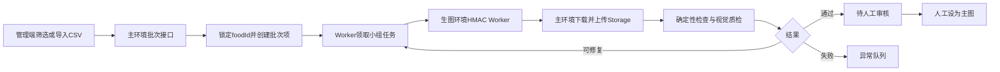

# 食物库批量生图流程设计

## 1. 背景与目标

当前食物图片流程已经支持单个食物创建生图任务、混元生成、上传主环境存储、候选图审核和设为主图，但批量入口仍要求调用方提前整理 `foodIds`，单批最多 100 条，缺少批次级进度、断点恢复、自动质检和异常汇总。

本设计把现有单食物流程扩展为可恢复的批量任务系统，服务于首版约 4,000–6,000 条标准食物的图片生成。目标是：

- 不手工维护数千个 ID；
- 以服务端锁定的 `foodId` 作为唯一任务对象，避免同名食物混淆；
- 首轮每个食物生成 1 张 4:3 图片，失败时有限重试；
- 自动过滤格式错误、主体错误和明显不合规图片；
- 支持暂停、继续、取消、失败重试和断点恢复；
- 只有人工确认后才把候选图设置为正式主图；
- 充分利用现有 `food_image_jobs`、`food_images` 和主环境存储，不改变小程序登录、主数据库环境或远程生图 Worker 边界。

## 2. 已确认的产品规则

### 2.1 生成规则

- 首轮 `candidateCount=1`。
- 图片目标为食物主体摄影，使用现有混元模型和提示词模板。
- 生成结果继续上传到主环境 CloudBase Storage；`storage_path` 是图片的唯一规范地址，小程序读取服务端依据它解析出的审核图片 CDN 地址。
- 外部临时 URL 不写入公开图片字段；`original_url`、`thumb_url`、`medium_url`、`detail_url` 不作为批量生图的持久化依赖。
- 图片默认保留现有 4:3 详情/列表/缩略图转换链路。

### 2.2 食物选择规则

- 批量选择首选服务端筛选，不要求用户手工填入数千个 ID。
- 筛选条件包括：图片状态、一级/叶子分类、地区、中文名、英文名、来源和数量上限。
- 支持“全选当前筛选结果”和手动排除。
- 支持 CSV 作为补充入口，格式为：

  ```csv
  foodId,name
  0f137163-2df5-4223-9b7b-5a1f4e459b65,鸡胸肉
  ```

- CSV 中如果同时提供 `foodId` 和名称，后端以 `foodId` 为准，名称只用于展示校验。
- 仅提供名称时，只有唯一匹配才自动加入；重名、跨语言歧义或找不到的名称进入导入错误列表，不自动猜测。
- 后端最终只保存真实 `foodId`，不能用名称作为任务主键。

### 2.3 额度与并发规则

- 6,000 条首轮预计消耗约 6,000 次生图额度。
- 每条任务最多自动重试 2 次，最坏约 18,000 次，低于当前 100,000 次额度。
- 逻辑批次可以包含 6,000 条；执行时拆成每组 50–100 条。
- Worker 初始并发 3，稳定后最高 5；单次 claim 只领取小组任务，避免长请求和数据库锁扩大。
- 运行中持续显示预计额度、已消耗和剩余任务，不在客户端预先假设所有任务必然成功。

## 3. 系统边界与架构



### 3.1 主环境

主环境 `lewis-healthy-d4glgqqzv73a5bc10` 负责：

- 食物、分类、图片和任务批次数据；
- 管理端筛选、预览、创建批次和进度查询；
- 调用远程生图 Worker；
- 下载临时图并上传主环境 Storage；
- 确定性检查、视觉质检、候选图审核和主图切换。

### 3.2 生图环境

生图环境 `dev-d8g3hqv2b0de38046` 只负责：

- 执行混元生图调用；
- 根据 HMAC 校验主环境请求；
- 返回临时图片地址和模型信息；临时地址只供主环境下载，不能写入食物图片的公开地址字段。

小程序不直接访问生图环境，也不持有生图密钥。

## 4. 数据模型

### 4.1 复用现有表

现有表继续承担单任务和候选图职责：

- `food_image_jobs`：单个食物的一次生成任务；
- `food_images`：生成后的候选图、审核状态、图片地址和评分；
- `foods.primary_image_id`：审核后正式主图引用。

现有评分字段优先复用：

- `food_match_score`；
- `style_score`；
- `quality_score`；
- `review_status`；
- `reject_reason`；
- `width`、`height`、`content_hash`。

### 4.2 新增 `food_image_batches`

建议字段：

| 字段 | 说明 |
| --- | --- |
| `id` | 批次 UUID |
| `name` | 管理员可读批次名 |
| `status` | `draft`、`running`、`paused`、`completed`、`completed_with_errors`、`cancelled` |
| `selection_json` | 创建批次时的筛选条件摘要，不作为任务唯一依据 |
| `candidate_count` | 首轮固定为 1 |
| `max_attempts` | 默认 3，包含首次生成 |
| `concurrency` | 默认 3，服务端限制最大 5 |
| `total_count` | 批次项总数 |
| `pending_count` | 待处理数量 |
| `generating_count` | 生成中数量 |
| `review_count` | 待人工审核数量 |
| `retry_count` | 重试中数量 |
| `failed_count` | 失败数量 |
| `completed_count` | 已完成数量 |
| `estimated_quota` | 创建时预计额度 |
| `consumed_quota` | 实际生图次数 |
| `created_by` | 管理员用户 ID |
| `started_at`、`finished_at` | 批次运行时间 |
| `created_at`、`updated_at` | 审计时间 |

### 4.3 新增 `food_image_batch_items`

建议字段：

| 字段 | 说明 |
| --- | --- |
| `id` | 批次项 UUID |
| `batch_id` | 所属批次 |
| `food_id` | 真实食物 ID |
| `status` | `pending`、`generating`、`quality_check`、`needs_retry`、`needs_review`、`completed`、`failed`、`skipped` |
| `job_id` | 当前或最近一次 `food_image_jobs` ID |
| `attempt_count` | 已尝试次数 |
| `last_image_id` | 最近候选图 ID |
| `qc_result_json` | 确定性检查和视觉质检摘要 |
| `error_code`、`error_message` | 最近错误 |
| `locked_at`、`locked_by` | Worker 领取信息 |
| `next_retry_at` | 下次可重试时间 |
| `created_at`、`updated_at` | 审计时间 |

约束：

- `unique(batch_id, food_id)`，同一批次不能重复加入同一个食物；
- 对处于 `pending`、`generating`、`quality_check`、`needs_retry` 的同一 `food_id` 建立应用层互斥锁，避免不同批次同时生图；
- 创建批次时再次检查食物状态和主图状态，不能只相信前端预览结果。

## 5. 批次创建与选择流程

### 5.1 管理端筛选预览

管理端新增“批量生图”页面，提供：

- 图片状态：无主图、已有候选、失败、全部；
- 分类：一级分类和叶子分类；
- 地区：中文常用、北欧常见、北美常见、欧美常见等；
- 名称：中文名、英文名、别名关键词；
- 来源：内部标准食物、参考数据导入等；
- 数量上限和排序方式。

预览结果展示中文名、英文名、分类、地区、来源、当前图片状态和 `foodId`。预览必须分页，不能一次把 6,000 条全部渲染到浏览器。

### 5.2 全选与排除

“全选当前筛选结果”只保存筛选条件和排除 ID，服务端创建批次时重新查询并锁定实际结果。这样不会因为浏览器只加载了第一页而漏掉后续食物。

提交前显示：

- 将加入的食物总数；
- 已有审核主图而会被跳过的数量；
- 已有进行中任务而会被跳过的数量；
- 预计生图额度；
- 按分类和地区的数量分布。

### 5.3 CSV 导入

CSV 用于精确补充或重跑指定食物，不替代筛选入口。导入分三步：解析、匹配预览、确认入批次。所有错误行都要返回行号和原因，例如“名称重名”“foodId 不存在”“食物已存在进行中任务”。

## 6. 执行状态与断点恢复

### 6.1 批次状态

- `draft`：已创建但未开始；
- `running`：允许 Worker 领取任务；
- `paused`：不再领取新任务，当前任务完成后停止；
- `completed`：所有批次项都已完成或明确跳过，不再需要人工处理；
- `completed_with_errors`：主流程结束，但仍有失败或人工复核项；
- `cancelled`：停止未开始任务，已完成图片和候选记录保留。

### 6.2 Worker 行为

1. 只从 `running` 批次领取 `pending` 或到期的 `needs_retry` 项；
2. 领取时写入 `locked_by`、`locked_at` 并变更为 `generating`；
3. 复查食物是否仍为可发布标准食物、是否已有审核主图；
4. 创建或复用单食物 `food_image_jobs`；
5. 生图、下载、转码、上传、创建候选图；
6. 执行确定性检查和视觉质检；
7. 根据结果更新批次项、单任务和批次统计；
8. 在每个小组结束后提交进度，避免长事务。

如果 Worker 心跳超时，定时恢复任务会把过期的 `generating` 或 `quality_check` 项退回 `pending` 或 `needs_retry`，防止中断后永久卡住。

批次项进入 `needs_review` 时，批次不能标记为 `completed`；只有人工通过并设置主图，或明确拒绝并标记为 `skipped`/`failed` 后，批次才可能进入最终状态。

### 6.3 幂等性

- 以 `batch_id + food_id + attempt_count` 作为一次尝试的逻辑标识；
- 重复触发 Worker 不重复创建正式主图；
- 上传成功但响应丢失时，先按内容哈希和任务 ID 查询已有候选，再决定是否重试；
- 只有人工审核动作可以改变 `foods.primary_image_id`。

## 7. 自动质检

### 7.1 确定性检查

不调用模型即可完成：

- 临时图下载成功；
- MIME 类型和文件大小合法；
- 图片可解码且不是空图/占位图；
- 尺寸和 4:3 比例符合转换结果；
- 内容哈希未与当前食物已有图片重复；
- `storage_path` 存在，且由主环境 API 解析出的缩略图、列表图和详情图 CDN 地址均可读取。

### 7.2 视觉检查

复用当前已配置的视觉模型能力，输出结构化结果：

- `food_match_score`：主体是否为目标食物；
- `style_score`：自然光、低饱和、构图和摄影风格；
- `quality_score`：清晰度、完整性和可用性；
- `issue_codes`：混入其他食物、文字、水印、包装、手、插画/3D、主体不明确等；
- 简短的 `reject_reason`。

### 7.3 判定规则

- 主体匹配度 ≥ 90 且风格分 ≥ 80：自动质检通过，进入待人工审核；
- 匹配度 70–89：根据问题码补充提示词，最多自动重试 2 次；
- 重试后仍处于 70–89：进入人工复核；
- 匹配度 < 70、主体错误、严重串菜、格式错误或上传失败：进入失败队列；
- 质检通过不等于正式发布，仍需人工“通过/设为主图”。

自动重试只修改与失败原因对应的 `extraPrompt`，不改变食物名称、分类和主体字段，避免重试时语义漂移。

## 8. 管理端接口

在现有 `/api/admin/food-image-jobs` 接口族上增量扩展：

| 方法 | 路径 | 用途 |
| --- | --- | --- |
| `GET` | `/api/admin/food-image-batches/preview` | 按筛选条件分页预览并统计 |
| `POST` | `/api/admin/food-image-batches` | 按筛选条件创建批次 |
| `POST` | `/api/admin/food-image-batches/import` | 上传 CSV 并返回匹配预览 |
| `GET` | `/api/admin/food-image-batches` | 查询批次列表和汇总 |
| `GET` | `/api/admin/food-image-batches/:id` | 查询批次详情、进度和异常 |
| `POST` | `/api/admin/food-image-batches/:id/start` | 启动批次 |
| `POST` | `/api/admin/food-image-batches/:id/pause` | 暂停批次 |
| `POST` | `/api/admin/food-image-batches/:id/resume` | 继续批次 |
| `POST` | `/api/admin/food-image-batches/:id/cancel` | 取消未开始项 |
| `POST` | `/api/admin/food-image-batches/:id/retry-failed` | 重试失败项 |
| `POST` | `/api/admin/food-image-batches/:id/approve` | 批量审核高置信候选图，需管理员确认 |
| `POST` | `/api/admin/food-image-jobs/worker` | 保留现有 Worker 入口，增加批次 claim |

批次创建请求示例：

```json
{
  "selection": {
    "imageStatus": "missing",
    "categoryCodes": ["meat_poultry", "vegetables"],
    "regionCodes": ["cn_common", "nordic", "north_america"],
    "query": "",
    "excludeFoodIds": []
  },
  "candidateCount": 1,
  "onlyMissing": true,
  "maxAttempts": 3,
  "concurrency": 3
}
```

所有接口继续使用现有管理员认证和主环境数据库权限，不把管理权限、HMAC 密钥或模型密钥放入小程序。

## 9. 迁移与上线顺序

1. 新增批次和批次项表、索引、状态约束和统计触发/更新逻辑。
2. 把现有单食物任务处理函数抽成可被单任务和批次 Worker 共用的执行单元。
3. 增加服务端筛选预览、批次创建和进度接口。
4. 增加批次 Worker claim、锁、超时恢复和幂等处理。
5. 接入确定性检查和视觉质检，复用现有图片评分字段。
6. 增加管理端批次页面和异常审核操作。
7. 先运行 10–20 条样本，确认提示词、质量阈值、`storage_path`、CDN 派生地址和审核体验。
8. 再按分类分批执行，每批 100–300 条；不建议一次性无监控启动全部 6,000 条。
9. 样本和小批次验收通过后，再按额度和审核吞吐量扩大批量。

## 10. 测试与验收

### 自动化测试

- 筛选条件能正确展开为完整食物集合；
- 全选当前筛选结果不会只创建第一页；
- CSV 唯一名称、重名、无效 ID 的处理符合规则；
- `unique(batch_id, food_id)` 和跨批次任务锁生效；
- Worker claim、超时恢复、暂停/继续和取消状态正确；
- 重复 Worker 请求不会创建重复候选图；
- 质检分数和问题码能正确映射到现有图片字段；
- 重试次数达到上限后不会继续消耗额度；
- 批次统计与批次项状态最终一致。

### 运行验收

- 10–20 条样本可以完整走完生成、上传、质检、审核和设为主图；
- 断开 Worker 或重复触发后，任务能继续且不重复生图；
- 暂停后不会继续领取新任务；
- 失败项能按原因筛选并单独重试；
- 小程序只看到主环境依据 `storage_path` 派生的审核图片 CDN 地址；
- 分类、北欧/北美食物和中文名称均能在批次预览中正确筛选；
- 真实生图额度、Worker 日志和数据库统计可以相互核对。

## 11. 非目标

- 不改变小程序登录、主数据库环境或生图环境的职责边界；
- 不把英文名称作为展示主名称；
- 不以 USDA 原始记录直接生成图片；
- 不自动把 AI 图片设为正式主图；
- 不在本阶段同时建设菜品库、食谱库或组合餐；
- 不引入独立搜索服务，当前 4,000–6,000 条规模继续使用数据库分页和索引。
