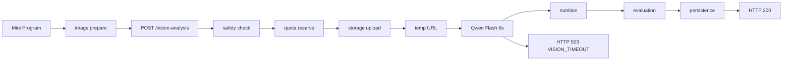
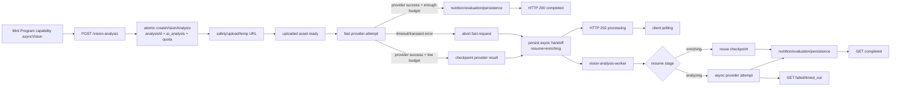
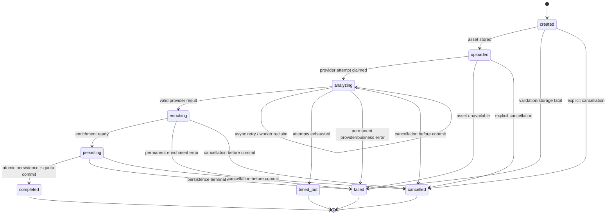

# Hybrid Vision Analysis：正式技术设计

状态：Draft v2，等待第二次设计审批。本设计已纳入真实 schema audit 结果，只描述目标架构和实施边界，不修改代码、数据库或生产配置。

## 1. Architecture Decision

采用 Hybrid Vision Analysis：

```text
快路径：保留当前同步体验，预算内完成则 HTTP 200
异步兜底：快路径不可完成则持久化同一个 analysisId，HTTP 202，独立 worker 继续处理
```

关键决策：

1. `createVisionAnalysis(...)` 是一个事务/RPC：服务端生成 `analysisId`，插入 `ai_analysis(status=created)`，并完成 Hybrid quota reserve；任一步失败全部回滚。
2. 复用并扩展现有 `ai_analysis` 作为唯一分析生命周期模型，不新增平行的 `analysis_jobs` 结果模型。真实 schema 已确认结果字段可为空，但 `provider/model` 必须显式提供，并需要新增生命周期与执行权字段。
3. `uploaded_assets.analysis_id` 是正式关系；历史资产允许为空。资产 retention 由显式清理处理，不使用 `ON DELETE CASCADE` 代替 retention policy。
4. 异步执行使用独立的 `vision-analysis-worker`、dispatcher 和 reaper，优先复用现有 HMAC/IAM internal invocation 模式；不使用 HTTP handler 返回后的 `setImmediate`、未等待 promise 或同一 provider request 继续运行。
5. 旧客户端通过 capability negotiation 保持旧行为；只有声明 `supportsAsyncVision: true` 的新客户端获得 HTTP 202。

## 2. Current vs Target Flow

### 当前链路



当前实现中，服务端总预算为 `12,500 ms`，Flash stage 上限为 `6,000 ms`，客户端总预算为 `15,000 ms`。失败时 provider request 在 6 秒边界被 abort，且当前 analysisId 通常要到完成 persistence 后才返回，导致失败请求没有稳定的任务主键。

### 目标链路



返回 202 前必须完成：原子任务记录存在、图片资产可被 worker 读取、`dispatch_state=queued` 且 `execution_owner=async`，或进入可被 reaper 发现的 durable queued 状态，quota 仍为 reserved。若 handoff 无法可靠完成，不能伪造 202，应返回旧的错误合约并释放 quota。

## 3. Analysis 状态机

状态、阶段、执行权和派发状态分离：`status` 表示业务生命周期，`current_stage` 表示工作位置，`execution_owner` 表示谁拥有执行权，`dispatch_state` 表示异步派发状态。



`created`、`uploaded`、`analyzing`、`enriching`、`persisting` 是 processing 状态；`completed`、`failed`、`timed_out`、`cancelled` 是 terminal state。所有状态转换必须带版本号或 compare-and-set，worker 不能覆盖较新的 terminal state。

内部并发字段：

```text
execution_owner = fast | async | none
dispatch_state  = none | queued | claimed | running | completed | failed
job_id          = async execution/claim ID
lease_until     = worker lease expiry
version         = CAS version
```

`status=analyzing` 可以同时存在 `execution_owner=async`；`dispatch_state=queued` 表示已返回 202 但尚未领取，`claimed/running` 表示 worker 已取得 lease。reaper 只 reclaim 过期 lease，迟到的 fast handler 必须因 version/owner 不匹配而 no-op。

## 4. Data Model

### 权威分析记录：现有 `ai_analysis`

真实 schema audit：`ai_analysis` 当前 54 条记录均为 `succeeded`；`id`、`user_id`、`provider`、`model`、`status`、时间字段为非空，结果字段和 `error_code` 可空，已有 `(user_id, client_request_id)` 唯一索引和 server-only RLS。它可以演进为任务表，但必须显式写入 provider/model/status，并增加下列字段。`uploaded_assets` 当前没有 `analysis_id`，需要新增 nullable 关系以兼容历史资产。

| 字段 | 说明 |
| --- | --- |
| `id` | `analysisId`，服务端 UUID/主键，由 atomic create RPC 生成 |
| `user_id` | 所属用户，禁止由客户端指定 |
| `client_request_id` | 客户端幂等键；建议 `(user_id, client_request_id)` unique |
| `status` | `created/uploaded/analyzing/enriching/persisting/completed/failed/timed_out/cancelled` |
| `current_stage` | 对外进度阶段 |
| `result` 或现有结果字段 | 未完成时为空，completed 时一次性写入 |
| `error_code` | 脱敏后的业务错误码 |
| `provider` / `model` | provider 与模型版本 |
| `provider_attempt` | 当前/最后一次 attempt 编号 |
| `job_id` | 异步 worker execution/claim ID，可为空；不替代 analysisId |
| `quota_state` | `reserved/committed/released` |
| `execution_owner` | `fast/async/none` |
| `dispatch_state` | `none/queued/claimed/running/completed/failed` |
| `lease_until` | worker lease 到期时间 |
| `version` | CAS 版本 |
| `deadline_at` | 后端允许继续执行到的时间 |
| `resume_stage` | `analyzing/enriching/persisting` |
| `provider_result` 或 `provider_result_ref` | checkpoint 的最小可复用结果；需按 Phase 1 schema design 决定，不写入 trace |
| `provider_completed_at` | provider 成功 checkpoint 时间 |
| `trace_id` | 关联 ops trace |
| `fast_path_outcome` | `completed/handed_off/legacy_failed` |
| `async_trigger_reason` | `fast_timeout/provider_5xx/transient_network/dispatch_recovery` |
| `created_at/updated_at/completed_at` | 生命周期时间 |
| `expires_at` | 客户端查询/结果保留期限，不等同于 deadline |

### 图片资产：现有 `uploaded_assets`

保留现有资产表，新增 `analysis_id UUID NULL`、FK 到 `ai_analysis.id` 和 `index(analysis_id)`。历史资产保持 NULL，不回填；不使用 `ON DELETE CASCADE` 作为 retention 机制。原始 storage path 不进入普通 trace；诊断只记录 `storage_object_key_hash`。

### 约束与索引

- `ai_analysis.id` 主键；`(user_id, client_request_id)` 唯一。
- 查询接口按 `(user_id, id)` 授权读取。
- worker claim 按 `status/current_stage/lease_until` 建索引。
- Hybrid quota transition 以 `analysis_id` 为主、`(user_id, client_request_id)` 为幂等键；旧 quota RPC 仅保留给旧链路。
- `createVisionAnalysis` 必须在同一事务中插入分析记录并 reserve quota；不能先调用现有 `reserve_vision_quota` 再插入分析记录。
- schema migration 必须为可前滚、可回滚，并保持历史 `uploaded_assets.analysis_id IS NULL` 合法。

## 5. API Contract

### POST `/vision-analysis`

现有字段保持兼容，新增能力声明：

```json
{
  "clientRequestId": "string",
  "imageBase64": "string",
  "contentType": "image/jpeg",
  "source": "camera|album",
  "diagnostics": {},
  "clientCapabilities": {
    "supportsAsyncVision": true,
    "clientVersion": "string"
  }
}
```

HTTP 200：同步完成。

```json
{
  "status": "completed",
  "analysisId": "uuid",
  "result": {},
  "retryCount": 0
}
```

HTTP 202：任务已可靠交给异步生命周期。

```json
{
  "status": "processing",
  "analysisId": "uuid",
  "currentStage": "analyzing",
  "pollAfterMs": 1500
}
```

如果任务尚未达到可安全 handoff 的条件，不返回 202；按旧错误合约返回，并完成 quota release。202 不携带 Base64、provider 原始 request ID 或可直接读取的 storage key。

### GET `/vision-analysis/:analysisId`

认证、用户归属和响应脱敏与 POST 相同；该接口无副作用。

processing：

```json
{
  "analysisId": "uuid",
  "status": "processing",
  "currentStage": "analyzing|enriching|persisting",
  "pollAfterMs": 1500
}
```

completed：返回 `status: completed`、同一 `analysisId` 和完整 `result`。failed/timed_out/cancelled：仍返回 HTTP 200，返回状态、稳定业务 `errorCode`、用户可读文案和 `retryable`；不得泄露 provider 内部错误详情。HTTP 404 仅用于不存在或按安全策略隐藏越权资源。

任务响应必须包含服务端权威的 `deadlineAt`；如需要限制结果查询保留时间，另返回 `expiresAt`。客户端不得用本地 polling 时长推断 timeout。

重复 POST 命中 `(user_id, client_request_id)` 时：`completed → HTTP 200` 返回已有结果，`processing → 新客户端 HTTP 202` 返回已有 `analysisId`，terminal failure → 返回固定的 terminal business outcome；三种情况都不重新 reserve 或调用 provider。用户主动重新识别必须生成新的 `clientRequestId`。

### 老版本兼容

旧客户端没有 `clientCapabilities.supportsAsyncVision` 时，服务端继续采用现有同步响应，不返回 202。新客户端显式声明能力后才启用 Hybrid fallback。feature flag 关闭时，新客户端也退回旧同步合约，便于回滚。

### Provider-success checkpoint

Hybrid handoff 有两条不同路径：

```text
provider 未成功
→ resume_stage=analyzing
→ worker 发起独立 provider attempt

provider 已成功但同步预算不足
→ checkpoint provider result
→ resume_stage=enriching
→ worker 直接继续 nutrition/evaluation/persistence
```

checkpoint 只保存 worker 所需的最小可复用结构；是否复用现有 `raw_recognition`/结果字段，还是增加受保护的内部字段，由 Phase 0.5 schema design 最终确定。原始 provider response 不写入 trace，且 checkpoint 写入必须受 `analysisId + version` 保护。

## 6. Timeout / Retry / Quota / Idempotency

### Budget

第一阶段不修改现有基线：fast provider 仍以约 6 秒为边界，服务端 12.5 秒、客户端 15 秒保持不变。目标是让新客户端在原请求 deadline 内完成任务创建和 202 handoff，而不是把 Flash timeout 直接拉长。

异步参数作为配置设计，不在本轮写入生产：

- fast path：约 5.5–6 秒，留出 response/handoff safety margin。
- async provider attempt：建议 15–20 秒，独立于 fast timeout。
- async total analysis：建议 30 秒级上限，由 worker lease 和全局 deadline 控制。
- polling：初始 1–1.5 秒，指数退避到 5 秒；terminal 后立即停止。

### Retry

fast path 只执行一次 provider attempt。provider 成功但剩余 budget 不足时，先保存 checkpoint 并以 `resume_stage=enriching` handoff，worker 不得重新调用 provider。只有 timeout、provider 5xx、临时网络错误才允许 worker 发起独立 provider attempt。provider 4xx、图片无效、安全拒绝、schema/business validation 不 retry。建议最多 2 次 provider attempts（一次 fast、一次 async）。

### Quota 原子性

Hybrid 创建流程必须由单一事务/RPC 保证：

```text
createVisionAnalysis(user_id, client_request_id, server_analysis_id)
  -> insert ai_analysis(created) + reserve quota atomically
commit(user_id, analysis_id)                       -> committed
release(user_id, analysis_id)                      -> released
```

旧 `reserve_vision_quota(user_id, client_request_id, ...)` 只保留给旧链路兼容，Hybrid 不直接调用。每个 transition 都是幂等的；`committed` 不能再次扣费，`released` 不能被旧 worker 改回 committed。quota reservation TTL 不承担 async job 生命周期；worker/reaper 根据 `deadline_at`、状态和 lease 显式 commit/release。当前生产 30 秒 TTL 在 Phase 1 migration 前不修改。

### 幂等边界

- POST：唯一键查找现有任务；completed 直接返回 200，processing 返回 202，terminal failure 返回同一 terminal 结果。
- fast→async：同一 `analysisId` 只允许一个有效 handoff；通过 CAS 设置 `execution_owner=async`、`dispatch_state=queued` 和 `resume_stage`。
- worker：先 claim lease，再调用 provider 或从 checkpoint 继续；无 lease 或版本过期不得写结果。
- persistence：以 `analysisId` 做唯一业务键；completed 后重复执行为 no-op。
- polling：只读，不 reserve、不调用 provider、不写 meal。

## 7. Frontend UX

前端状态：

```text
preparing → uploading → analyzing → enriching → completed
                                      ↘ processing/polling
processing/polling → completed | failed | timed_out | cancelled
```

- `VISION_UPLOAD_FAILED` 只用于真正的 image prepare/upload 失败。
- `VISION_TIMEOUT` 在新流程中表示“已转入后台”或最终 timeout，不再显示“上传失败”。
- 收到 200 直接进入现有结果页；收到 202 进入识别中页面，显示阶段性文案和可离开提示。
- 本地以 `analysisId + clientRequestId` 保存未完成任务；页面重新进入或 App 从后台恢复时先 GET 状态，再决定继续 polling 或展示结果。
- polling 使用当前登录态和用户归属校验；网络暂时失败只暂停并退避，不创建新 POST。
- 轮询超过 async total deadline 后显示可重试的业务错误，但重试必须生成新的 `clientRequestId`，不能复用已 terminal 的任务。

## 8. Observability

保留现有 Diagnostic Instrumentation，并以 `analysisId` 作为 correlation root：

```text
clientRequestId
      ↓
analysisId  ← correlation root
   ↙   ↓   ↘
traceId traceId traceId ...
       ↓
   jobId / attempt
```

一个 analysis 可以有 POST trace、多个 GET polling trace、worker/reaper trace，以及 worker reclaim 后的多个 job execution。`ai_analysis.trace_id` 只保存 root/initial trace；ops trace 和 job execution 必须按 `analysisId` 一对多记录，不能互相覆盖。

新增或标准化：

```text
fastPathOutcome
asyncTriggerReason
providerAttempt
providerDurationMs
asyncDurationMs
totalAnalysisDurationMs
handoffDurationMs
workerLeaseState
```

阶段至少覆盖：`safety_check`、`storage_upload`、`temp_url_generation`、`flash_fast`、`async_dispatch`、`flash_async`、`nutrition`、`evaluation`、`persistence`。

图片关联使用 `imageSha256` 和 `storageObjectKeyHash`；不记录 Base64、原始图片、secret、原始 provider request ID。Admin Console 只展示脱敏后的状态、耗时、错误码和 hash，支持按 traceId/analysisId/clientRequestId 查询。

## 9. Security / Privacy

- 所有 POST/GET 都必须通过现有用户认证；服务器从 session 得到 `user_id`。
- worker 只接受内部签名/CloudBase IAM 调用，不开放给小程序或公网匿名调用。
- status endpoint 强制检查 `analysis.user_id == session.sub`。
- 图片临时 URL 仅供 provider 使用，设置最小有效期；任务结束后按现有 retention policy 清理。
- 日志和 trace 使用 allowlist 字段；provider 原始 request ID 只存 hash。
- 任务和资产的失败清理必须可重入，不能删除仍被 processing job 使用的对象。

## 10. Migration / Compatibility

Phase 0 read-only audit 已确认：现有 `ai_analysis` 可演进但缺少 execution/dispatch/checkpoint/deadline 字段；历史 54 条记录的 `status` 全为 `succeeded`；`uploaded_assets` 缺少 `analysis_id`；quota RPC 只以 `(user_id, client_request_id)` 为键且现有 TTL 是短期 reservation，不具备 Hybrid 原子创建能力。Phase 0.5 closure 采用以下契约：

- migration up 将现有 `status='succeeded'` backfill 为 `status='completed'`，之后新状态集合不再允许 `succeeded`。
- migration down 只允许在记录被明确标记为 legacy-backfill、且没有新任务状态/更新依赖时恢复为 `succeeded`；不做无条件反向 UPDATE。
- durable source of truth 是 PostgreSQL `ai_analysis` 的 queued row；立即 HMAC 调用只是低延迟 trigger，不承担 durability。
- dispatcher timer 扫描 `execution_owner=async`、`dispatch_state=queued` 且未过期的记录，调用受保护 worker；reaper 对 `claimed/running` 且 `lease_until < now()` 的记录做 CAS reclaim。
- Hybrid reservation 使用 `analysis_id`、`reservation_state`、`reservation_expires_at`；`reservation_expires_at` 必须晚于 `deadline_at` 加 persistence/reaper grace。当前旧链路 30 秒 TTL 不修改。

API 采用能力协商而非强制版本切换：

- 旧前端不传 capability：旧同步合约。
- 新前端传 `supportsAsyncVision: true`：允许 202 和 GET polling。
- feature flag 关闭：所有客户端退回同步合约。
- 新前端发现服务端不支持 202/GET：降级为旧错误映射，不循环 polling。

## 11. Phase 1–3 Implementation Plan

### Phase 1 — Async foundation

范围：

- 修改 `ai_analysis`/`uploaded_assets` 及 quota RPC 的 schema/API，使 `createVisionAnalysis` 能在 provider 前原子创建任务与 reservation。
- 增加只读 GET status contract。
- 增加独立 worker、claim lease、reaper 和内部触发机制；优先复用现有 HMAC/IAM internal invocation 模式。
- 将 PostgreSQL queued row 作为 durability source of truth；immediate HMAC trigger 失败时由 timer dispatcher 扫描补偿。
- 增加 `vision-analysis-dispatcher` timer 和 `vision-analysis-reaper` 设计/实现，处理 queued dispatch 与 expired lease reclaim。
- 支持 `resume_stage=analyzing|enriching`，provider-success checkpoint 不重复调用 provider。
- migration up/down 明确处理既有 `succeeded → completed` backfill，禁止无条件 down migration。
- Hybrid reservation 的 `reservation_expires_at` 必须覆盖 `deadline_at + grace`，不能由旧 30 秒 TTL 自动 release processing job。
- 实现 quota transition、analysisId 幂等和 persistence no-op 保护。
- feature flag 默认关闭，不改变线上 POST 行为。

测试：schema migration rollback；重复 POST；并发 reserve；worker crash/reclaim；重复 commit/release；权限隔离；GET 无副作用；无敏感字段。

Deployment Gate：migration readback、function artifact readback、内部 worker 健康检查、旧 POST regression、quota RPC regression，全都通过后才进入 Phase 2。

回滚：关闭 flag；停止新 worker claim；保留已完成任务只读；对未完成任务执行安全 drain/release，不删除仍需追踪的资产。

验收：可以创建 processing job 并查询，但生产用户仍只看到旧同步行为。

### Phase 2 — Hybrid fast-path fallback

范围：

- 新前端发送 capability 并处理 200/202/GET。
- fast provider 超时/临时错误时明确 abort，完成 async handoff，独立 worker 继续。
- 更新错误映射、后台恢复、polling 和 trace correlation。
- 保持 JPEG/HEIC/provider/model/nutrition 策略不变。

测试：简单样本 200；复杂样本 202；fast success 与 async success 不重复 persistence；handoff 失败不返回 202；旧客户端不收到 202；quota 三种 terminal 结果；app background/reopen。

Deployment Gate：同一 artifact SHA 的受控真机 smoke；trace 能串起四级 ID；HTTP 200/202/GET 契约；worker 失败恢复；无 429 burst 污染；诊断字段完整。

回滚：关闭 Hybrid flag，新客户端恢复旧同步合约；对已 processing 任务继续 drain 或标记可重试 terminal，禁止新旧 worker 同时争抢同一任务。

验收：新客户端复杂图片不再因 6 秒边界直接显示上传失败；成功结果与同步结果 schema 一致。

### Phase 3 — Production controlled rollout

范围：

- 按用户/版本/环境灰度，例如 5% → 25% → 100%。
- 监测 200 ratio、completion ratio、P95/P99 provider/async duration、quota leak、duplicate persistence、polling error、worker backlog。
- 稳定后再决定是否调整 fast budget、async budget 或进一步异步化；本计划不预先批准这些改变。

Deployment Gate：每级灰度均有 artifact SHA、flag、时间窗口和回滚阈值；无持续 quota leak、重复扣费、任务积压或旧客户端兼容回归。

回滚：一键关闭 flag，保留 GET 只读；停止新 202 handoff，完成或安全释放已有 processing job；恢复旧前端/后端合约。

验收：生产 trace 可完成端到端归因；用户可在前后台切换后拿到最终结果；失败均映射到正确业务文案。

## 12. Risks and Open Decisions

- 现有 `ai_analysis` 虽允许结果字段为空，但当前只有 completed-like 数据和默认 `succeeded` 状态；必须通过 migration 增加任务生命周期字段，不能在编码中临时拆出第二套模型。
- 原子 `createVisionAnalysis` 需要同一事务写 `ai_analysis` 与 quota reservation；旧 quota RPC 不能直接复用为 Hybrid 创建动作。
- `uploaded_assets.analysis_id` 必须允许历史 NULL，且不能用 FK cascade 代替独立 retention/purge。
- 202 handoff 与 worker trigger 之间存在短暂故障窗口；必须用 durable queued 状态和 reaper 覆盖。
- provider 同时承载 fast 与 async attempt 可能增加费用；attempt 上限和 terminal no-op 必须可观测。
- async 结果可能在用户重新提交后晚到；旧任务必须按 `analysisId` 隔离，不能覆盖新任务。
- polling 可能放大请求量；退避、终态停止和前端恢复去重是上线门槛。
- “取消”需要明确是否真的支持 provider cancel；在未实现前只能通过 terminal guard 阻止后续写入，不能声称已取消 provider 请求。

Draft v2 的解锁条件：

1. 批准 `createVisionAnalysis` 原子 RPC 和 quota transition 模型。
2. 批准 `execution_owner/dispatch_state/lease/version` 的并发语义。
3. 批准 provider-success checkpoint 与 `resume_stage=enriching`。
4. 批准 `deadline_at` 与 `expires_at` 的职责分离及 terminal HTTP contract。
5. 批准独立 worker + durable dispatcher/reaper 的具体 CloudBase trigger 方案。
