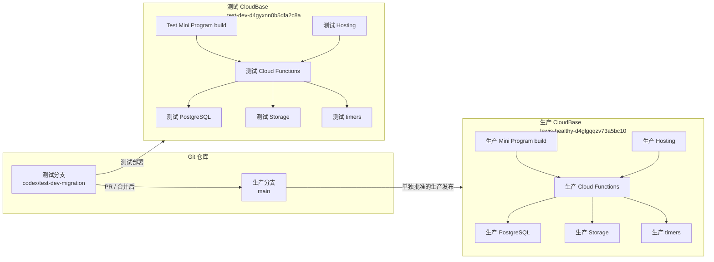

# Nordic Nutri AI 测试环境隔离与生产发布设计

> 状态：提案，待确认后实施  
> 日期：2026-08-20  
> 当前生产环境：`lewis-healthy-d4glgqqzv73a5bc10`  
> 目标测试环境：`test-dev-d4gyxnn0b5dfa2c8a`  
> 设计基线：Git commit `0117e2c`

## 1. 目标

建立一套与当前生产环境隔离的 CloudBase 开发环境。后续开发先在测试环境完成，经过测试和真实链路验收后，再将代码合并到生产分支，并由独立的生产发布步骤决定是否部署。

本设计的核心保证是：

1. 测试环境不读取、写入或删除生产用户数据。
2. 测试环境的云函数、PG、Storage、Hosting、定时器和密钥均独立。
3. 测试分支的部署目标始终显式指定为 `test-dev-d4gyxnn0b5dfa2c8a`。
4. 代码合并到 `main` 不自动触发生产函数、数据库或 Hosting 更新。
5. 生产环境只有在单独批准后才执行 migration、函数发布或前端发布。

## 2. 当前系统基线

当前仓库是 Taro/React 微信小程序 + CloudBase 后端，后端包含：

- `cloudbase/functions/get-login-ticket/`：主 HTTP 函数，承载微信登录、产品接口、AI、图片识别和管理接口。
- `cloudbase/functions/nordic-api/`：独立 API 函数。
- `cloudbase/functions/hunyuan-image-worker/`：图片生成 Worker。
- `cloudbase/functions/nutrition-insight-worker/`：营养洞察 Worker。
- `cloudbase/functions/food-image-batch-dispatcher/`：食物图片批处理调度。
- `cloudbase/functions/vision-analysis-dispatcher/`：视觉分析调度，并带定时器。
- `cloudbase/functions/vision-analysis-worker/`：视觉分析 Worker。
- `cloudbase/functions/vision-analysis-reaper/`：视觉任务回收，并带定时器。
- `cloudbase/functions/vision-image-purge-dispatcher/`：视觉图片清理调度。

数据库迁移位于 `cloudbase/pg/migrations/`，当前代码库包含核心业务、食物库、图片任务、AI 洞察、管理后台、异步视觉分析和配额相关迁移。迁移必须以目标测试数据库为先行验证环境，不允许把生产数据库作为开发调试数据库。

当前生产配置中还存在以下环境耦合点，实施前必须全部盘点：

- 小程序 API 中的生产函数 HTTPS 地址。
- 小程序中的 CloudBase publishable key。
- Storage/CDN 地址和图片资源根路径。
- Admin Hosting 地址。
- Worker 之间的内部 HTTPS 地址。
- `TCB_ENV`、`CLOUDBASE_APIKEY`、Session Secret、微信和 AI 配置。
- CloudBase 函数定时器和触发器。

## 3. 范围与非目标

### 3.1 本次范围

- 创建测试环境的资源复制方案。
- 设计代码、配置、数据库、函数和发布边界。
- 设计测试环境函数部署和定时器启用顺序。
- 设计测试分支到生产分支的合并与发布闸门。
- 设计回滚、验证和审计证据。

### 3.2 非目标

- 不复制真实生产用户、Session、餐食、反馈、管理操作或真实图片。
- 不把生产 PG 数据库导出到测试环境。
- 不在本设计阶段创建 CloudBase 资源。
- 不在本设计阶段执行 migration、部署函数或修改生产配置。
- 不引入 RBAC、多角色后台或新的后端框架。
- 不改变现有业务 API 合同、页面布局或生产运行架构。

## 4. 总体架构



测试环境和生产环境之间不允许存在运行时调用关系。测试 Worker 不得请求生产 Worker，测试函数不得使用生产 PG 或生产 Storage，生产小程序也不得被改成请求测试函数。

## 5. 分支与工作区策略

### 5.1 分支

```text
main
└── 生产代码基线，只接受经过测试的合并

codex/test-dev-migration
└── 测试环境复制和后续开发
```

测试分支从已推送的 `0117e2c` 创建。所有测试环境配置改动、部署脚本和环境映射首先进入测试分支。生产分支不直接用于日常开发。

### 5.2 工作区保护

- 不在 `main` 上直接修改生产环境 ID。
- 不用未确认的当前 CLI 默认环境执行 CloudBase 写操作。
- 每次部署前输出并人工确认 canonical EnvId。
- Git 提交前检查 `.env*`、私钥、API Key、Session、数据库凭据和真实数据文件。
- 只提交非敏感配置模板和资源清单，不提交真实环境变量值。

## 6. 配置设计

### 6.1 环境相关配置

环境相关配置必须显式区分测试和生产，不能依赖当前目录、当前 CLI 登录态或默认环境。

建议维护以下非敏感配置模板：

```text
config/cloudbase.test.json
config/cloudbase.prod.json
mini-program/.env.test.example
mini-program/.env.production.example
```

模板可以包含：

- canonical `envId`；
- 函数基础 URL；
- Storage/CDN 根地址；
- Hosting 路径；
- 构建环境名称；
- 非敏感的功能开关；
- 函数名称、运行时、超时和定时器表达式。

模板不得包含：

- `WX_SECRET`；
- `CLOUDBASE_APIKEY`；
- `APP_SESSION_SECRET`；
- `IDENTITY_HASH_PEPPER`；
- AI Provider Key；
- Worker 共享密钥；
- 数据库密码、访问令牌或私钥。

### 6.2 可复用与不可复用配置

| 配置或资源 | 测试环境处理 | 生产环境处理 |
|---|---|---|
| 函数代码 | 复制同一版本 | 保持独立部署 |
| 函数名称、运行时、超时 | 可复制 | 可复制 |
| 定时器频率 | 可复制，初期可关闭 | 保持生产配置 |
| 函数 HTTPS 地址 | 必须使用测试地址 | 保持生产地址 |
| CloudBase publishable key | 测试环境重新生成 | 保持生产 Key |
| `TCB_ENV` | 目标测试 EnvId | 生产 EnvId |
| `CLOUDBASE_APIKEY` | 测试环境专用 | 生产环境专用 |
| `APP_SESSION_SECRET` | 测试专用 | 生产专用 |
| `IDENTITY_HASH_PEPPER` | 建议测试专用 | 生产专用 |
| `WX_APPID` | 同一小程序时可复用 | 生产继续使用 |
| `WX_SECRET` | 同一 AppID 时技术上可复用，但只存函数端 | 生产继续使用 |
| AI Provider Key | 最好测试专用，设置预算 | 生产专用或受控复用 |
| Storage/CDN 域名 | 必须重新生成 | 保持生产地址 |
| Hosting 域名 | 必须独立 | 保持生产地址 |
| PG 数据 | 只使用测试数据 | 保持生产数据 |

如果测试和生产共用微信 AppID，微信登录凭证可以相同，但测试环境必须使用独立 Session Secret、独立 PG 和测试账号。测试环境不得因为共用 AppID 而查询生产用户数据。

## 7. PostgreSQL 与 migration 设计

### 7.1 数据隔离原则

测试 PG 与生产 PG 必须是两个独立资源。禁止使用生产数据库连接串、生产 `CLOUDBASE_APIKEY` 或生产管理员凭据连接测试数据库。

测试环境只导入：

- migration 创建的 schema、表、索引、RLS、RPC 和触发器；
- 不含个人信息的基础食物分类和字典数据；
- 明确标记的测试种子数据。

不得导入：

- 生产 `app_users`；
- 真实餐食和健康档案；
- 生产 Session、Token 或身份映射；
- 真实反馈、管理审计和删除记录；
- 真实用户图片和视觉分析原图。

### 7.2 migration 顺序

```text
新增 migration
  ↓
本地静态检查与 migration 测试
  ↓
测试 PG plan / apply
  ↓
测试函数回读 schema、RLS、RPC
  ↓
测试小程序和后台真实链路
  ↓
合并到 main
  ↓
生产 migration preflight
  ↓
单独批准后执行生产 migration
```

### 7.3 兼容性规则

生产 migration 必须优先采用向前兼容方式：

1. 先增加新表、新列、新函数或新索引。
2. 先部署能同时理解旧结构和新结构的函数。
3. 完成生产数据和请求链路验证。
4. 最后才考虑删除旧列、旧函数或旧约束。

破坏性 migration 必须单独列出备份、回滚或恢复方案，不能作为普通代码合并的一部分自动执行。

## 8. Cloud Functions 部署设计

### 8.1 统一资源清单

函数清单以仓库的 `cloudbaserc.json` 为基础，但部署时必须生成或读取明确的测试/生产目标配置。不能通过修改生产配置文件来切换环境。

每个函数至少需要记录：

- 函数名；
- 类型：HTTP 或 Event；
- 入口文件和 handler；
- runtime；
- timeout；
- 是否安装依赖；
- 触发器和 cron；
- 依赖的数据库、Storage、Worker 和环境变量；
- 测试部署状态和生产部署状态。

### 8.2 测试环境部署顺序

1. 创建并验证测试 PG、Storage 和 Hosting。
2. 配置测试函数环境变量，确认没有生产地址或生产密钥。
3. 部署 `hunyuan-image-worker` 和 `nutrition-insight-worker`。
4. 部署 `get-login-ticket`、`nordic-api` 等入口函数。
5. 部署视觉 Worker、图片 Worker 和调度函数。
6. 部署 dispatcher/reaper，但初始保持定时器关闭或低风险状态。
7. 完成受保护 HTTP smoke test。
8. 最后启用测试定时器并验证任务不会访问生产资源。

### 8.3 生产环境函数更新

生产函数更新必须遵守：

- 只从已经在测试环境验收的 commit 构建部署包。
- 部署前明确目标为生产 EnvId。
- 只部署本次批准的函数，不上传整个未审查工作区。
- 对 `get-login-ticket` 等核心函数先保存线上版本信息和回滚包。
- 部署后读取函数状态，确认 `Active / Available / CodeResult=success`。
- 使用无副作用或最小副作用的线上 smoke test。
- 不把测试环境 URL、测试 API Key 或测试 Worker 地址带入生产。

### 8.4 函数变更兼容性

涉及已有 API 路由时，优先保持：

- 旧请求字段仍可解析；
- 旧响应字段仍保留；
- 新字段可选；
- 失败时返回稳定公开错误码；
- 未认证、跨用户和非法输入仍 fail closed。

如果一个函数同时承载登录、业务接口、AI、视觉和管理路由，变更必须运行该函数的完整相关测试集，而不是只测试新增路由。

## 9. 定时器与后台任务设计

测试环境可以复制生产定时器的 cron 表达式，但必须满足：

- 定时器绑定的是测试函数。
- 测试函数只读取测试 PG 和测试 Storage。
- 测试 Worker 地址是测试地址。
- 测试任务使用测试队列和测试任务记录。
- 初次部署时先关闭定时器，待手工 smoke test 通过后再启用。

生产定时器不因为测试部署而修改。测试环境的 dispatcher、worker、reaper 必须有清晰的环境日志字段，至少包含 EnvId、函数名、任务 ID 和请求 ID，便于确认没有跨环境调用。

## 10. Storage 与 Hosting 设计

### 10.1 Storage

测试环境使用独立 Storage。测试图片只允许来自：

- 测试账号上传；
- 合成图片；
- 明确授权的无敏感样例。

生产图片 URL、对象键和临时下载链接不得写入测试数据库。代码可以复用对象路径规则，但不能复用生产 bucket、域名或对象内容。

### 10.2 Hosting

管理后台代码可以复用，但测试 Hosting 必须是独立发布目标。测试后台的 API Base、登录配置和 Storage 地址必须指向测试环境。

测试 Hosting 验收至少包括：

- 测试管理员登录；
- 测试食物数据读写；
- 测试图片候选审核；
- 测试批次和诊断页面；
- 不出现生产 API 地址；
- 不加载生产用户或图片。

## 11. 小程序前端切换

前端保持同一套业务代码，通过构建配置切换运行时目标：

```text
development build
  API → 测试 get-login-ticket
  CloudBase key → 测试 publishable key
  CDN → 测试 Storage/CDN
  env → test-dev-d4gyxnn0b5dfa2c8a

production build
  API → 生产 get-login-ticket
  CloudBase key → 生产 publishable key
  CDN → 生产 Storage/CDN
  env → lewis-healthy-d4glgqqzv73a5bc10
```

构建检查必须对产物进行字符串扫描，确认：

- 测试产物不包含生产函数域名、生产 CDN 域名或生产 publishable key。
- 生产产物不包含测试函数域名、测试 CDN 域名或测试 publishable key。
- 前端产物不包含 `WX_SECRET`、API Key、数据库凭据或 Worker 共享密钥。

## 12. 合并、发布与回滚

### 12.1 合并流程

```text
测试分支开发
  ↓
本地单测 / 类型检查 / 构建
  ↓
部署测试 CloudBase
  ↓
测试环境真实链路验收
  ↓
生成测试证据
  ↓
PR 合并 main
  ↓
生产发布评审
```

合并内容只代表代码进入生产候选基线，不代表已发布到生产。

### 12.2 生产发布闸门

生产发布前必须明确记录：

- 目标 commit SHA；
- 本次涉及的函数；
- 是否涉及 PG migration；
- 是否涉及 Storage 或 Hosting；
- 是否涉及环境变量；
- 测试环境验收结果；
- 生产回滚方式；
- 生产 smoke test；
- 未验证项目和剩余风险。

任何一个目标环境无法确认、密钥来源不明、migration 未在测试环境执行或函数地址未完成替换时，生产发布为 NO-GO。

### 12.3 回滚

- 代码回滚：重新部署上一个已验证函数 artifact。
- 前端回滚：恢复上一个已验证 Hosting 目录和小程序构建产物。
- 数据库回滚：优先使用前向修复；只有存在经过验证的 rollback migration 时才执行反向迁移。
- 定时器回滚：先暂停新增或异常定时器，再恢复上一版函数。
- 密钥回滚：恢复上一个受控 Secret 版本，不把密钥写入 Git。

## 13. 验收矩阵

### 13.1 环境隔离

- [ ] 测试函数详情显示目标 EnvId 为 `test-dev-d4gyxnn0b5dfa2c8a`。
- [ ] 生产函数详情仍显示生产 EnvId。
- [ ] 测试 PG 与生产 PG 是不同资源。
- [ ] 测试 Storage 与生产 Storage 是不同资源。
- [ ] 测试 Hosting 与生产 Hosting 是不同目标。
- [ ] 测试 Worker 地址全部为测试域名。
- [ ] 生产 Worker 地址没有被测试部署改变。

### 13.2 数据隔离

- [ ] 测试环境无真实生产用户。
- [ ] 测试环境无生产 Session 和 Token。
- [ ] 测试环境无生产餐食、反馈、审计和图片。
- [ ] 测试账号可以完成登录和基础业务流程。
- [ ] 测试用户之间无法越权读取或写入数据。

### 13.3 函数与任务

- [ ] 所有测试函数为 `Active / Available`。
- [ ] HTTP 函数使用测试地址完成受保护 smoke test。
- [ ] Worker 互调只发生在测试环境。
- [ ] 定时器启用后只处理测试 PG 的任务。
- [ ] 测试函数环境变量不存在生产地址和生产密钥。

### 13.4 合并与生产保护

- [ ] 测试构建和生产构建的地址扫描通过。
- [ ] 测试环境验收证据已保存。
- [ ] PR 合并不会自动触发生产部署。
- [ ] 生产 migration 有独立批准记录。
- [ ] 生产函数部署使用显式生产 EnvId。
- [ ] 生产部署后完成状态回读和 smoke test。

## 14. 实施阶段

### 阶段 0：只读盘点

- 固化生产函数、定时器、PG migration、Storage、Hosting 和环境变量名称清单。
- 验证目标 EnvId 的访问权限和资源状态。
- 不执行任何 CloudBase 写操作。

### 阶段 1：建立代码隔离

- 从 `0117e2c` 创建测试分支。
- 增加测试/生产非敏感配置模板或部署参数。
- 增加环境目标检查，阻止测试部署误指向生产。

### 阶段 2：建立测试资源

- 创建或确认测试 PG、Storage、Hosting 和身份配置。
- 执行 schema migration 和测试 seed。
- 配置测试函数环境变量。

### 阶段 3：部署和验收测试函数

- 按依赖顺序部署 Worker、入口函数和 dispatcher/reaper。
- 关闭定时器完成静态和手工验证。
- 启用测试定时器并验证异步链路。

### 阶段 4：接入测试小程序和后台

- 生成测试构建。
- 验证登录、餐食、AI、图片、后台和定时任务。
- 执行产物地址与敏感信息扫描。

### 阶段 5：固化发布流程

- 测试验收通过后创建 PR。
- 合并到 `main`，但不自动生产部署。
- 生产发布采用单独的函数、migration、Hosting 和前端发布闸门。

## 15. 主要风险与控制

| 风险 | 控制措施 |
|---|---|
| 测试函数误连生产 PG | 显式 `TCB_ENV`、目标 EnvId preflight、部署前地址扫描 |
| 测试 Worker 调用生产 Worker | 所有 Worker 地址环境化，并做域名扫描 |
| 测试定时器写入生产任务 | 测试函数专用 PG 和任务表，先关闭后启用 |
| 生产 Secret 进入 Git | 只提交模板，提交前扫描敏感变量和文件 |
| 合并后自动影响线上 | 分离 CI 合并和生产部署，生产部署人工批准 |
| migration 在生产失败 | 测试 PG 先执行，生产执行前做 preflight 和备份/恢复确认 |
| 测试数据污染生产 | 不复制真实数据，测试数据库和 Storage 完全独立 |
| 函数更新导致旧前端失败 | 保持 API 向前兼容，先测试后生产，保留上一版 artifact |
| 生产函数发布范围过大 | 只部署批准的函数和明确的完整目录 |

## 16. 设计结论

推荐采用“同一套代码、两套 CloudBase 资源、两套运行时配置、两条独立发布链路”的方案。

最重要的边界不是 Git 分支本身，而是：

1. 测试与生产使用不同 CloudBase EnvId。
2. 测试与生产使用不同 PG、Storage、Hosting 和函数地址。
3. Session Secret、身份 Pepper、CloudBase API Key 和 AI 配置独立。
4. migration 和云函数部署不随代码合并自动执行。
5. 生产发布始终需要明确的目标环境、变更清单、验证证据和回滚方案。

在这些边界成立后，后续开发可以安全地先在 `test-dev-d4gyxnn0b5dfa2c8a` 上进行；测试通过后合并到 `main`，不会因为合并动作本身影响当前生产用户和生产数据。

